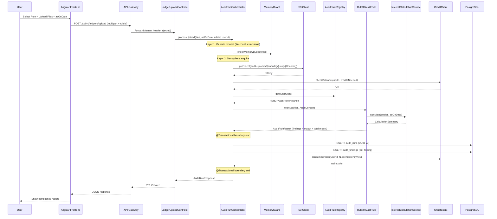

# GST Audit Engine — Implementation Plan (HLD + LLD)

> **Status**: Awaiting final approval before code execution  
> **Authors**: AI Architect + Pawan Yadav  
> **Date**: 2026-04-05  
> **Branch**: `main` (dev/test — production release only after full stability)

---

## 1. Executive Summary

Refactor the Rule 37 MVP into a **generic, SOLID-based Audit Rule engine** capable of supporting 18+ GST compliance modules. This document covers:

- **HLD** — System architecture, data flow, component interaction
- **LLD** — Java interfaces, JPA entities, Flyway DDL, REST contracts, Angular refactoring
- **Verification** — Test matrix covering unit, integration, migration, and E2E

### Architectural Decisions Log

| ID | Decision | Rationale |
|----|----------|-----------|
| **D1** | UUID v7 for all primary keys | Time-sorted (no B-Tree fragmentation), globally unique, SaaS-secure (un-guessable) |
| **D2** | Single V2 Flyway migration (create + migrate + drop) | `main` is dev/test; prod release only after full stability |
| **D3** | Raw uploads stored in S3 with lifecycle cleanup | Prevents DB bloat; WORM audit trail; auto-delete after N days |
| **D4** | `AuditRule<I,O>` generic interface | Strategy Pattern; each GST rule is a pluggable bean |
| **D5** | UX Designer skill for frontend overhaul | Premium compliance workspace replacing single-rule UI |
| **D6** | Deterministic Python sidecar for parsing (future) | LLM-free extraction pipeline per [ROADMAP.md](docs/ROADMAP.md) |

---

## 2. High-Level Design (HLD)

### 2.1 Target Architecture

```mermaid
graph TD
    subgraph "Angular Frontend (Amplify)"
        FE_DASH[Compliance Dashboard]
        FE_UPLOAD[Rule-Aware Upload]
        FE_HISTORY[Audit Run History]
        FE_EXPORT[Export / Download]
        FE_API[AuditApiService]
    end

    subgraph "API Gateway (Spring Cloud)"
        GW[API Gateway]
    end

    subgraph "Backend Service (Spring Boot 3.5 / Java 21)"
        subgraph "REST Layer"
            CTRL_AUDIT[AuditRunController<br>/api/v1/audit/runs]
            CTRL_UPLOAD[LedgerUploadController<br>/api/v1/ledgers/upload]
            CTRL_EXPORT[AuditExportController<br>/api/v1/audit/runs/{id}/export]
        end

        subgraph "Engine Layer (NEW)"
            REGISTRY[AuditRuleRegistry]
            RULE_37[Rule37AuditRule]
            RULE_LF[LateFeeAuditRule<br>Phase 2]
            RULE_ITC[Itc2bMatchRule<br>Phase 3]
            ORCH[AuditRunOrchestrator]
        end

        subgraph "Domain Layer (UNCHANGED)"
            CALC[Rule37InterestCalculationService]
            PARSER[LedgerExcelParser]
        end

        subgraph "Infrastructure"
            S3_CLIENT[S3Client<br>Raw Upload Storage]
            CREDIT[CreditClient<br>Auth Service]
            MEM[MemoryGuard]
            SEM[Semaphore]
        end

        subgraph "Persistence"
            REPO_RUN[AuditRunRepository]
            REPO_FIND[AuditFindingRepository]
        end

        subgraph "Scheduler"
            RETENTION[RetentionScheduler]
        end
    end

    subgraph "Data Stores"
        PG[(PostgreSQL<br>audit_runs<br>audit_findings<br>late_fee_relief_windows)]
        S3[(S3 Bucket<br>audit-uploads/)]
    end

    FE_DASH --> FE_API
    FE_UPLOAD --> FE_API
    FE_HISTORY --> FE_API
    FE_EXPORT --> FE_API
    FE_API -->|HTTP| GW
    GW --> CTRL_AUDIT
    GW --> CTRL_UPLOAD
    GW --> CTRL_EXPORT

    CTRL_UPLOAD --> ORCH
    CTRL_AUDIT --> REPO_RUN
    CTRL_EXPORT --> REPO_RUN

    ORCH --> MEM
    ORCH --> SEM
    ORCH --> CREDIT
    ORCH --> S3_CLIENT
    ORCH --> REGISTRY

    REGISTRY --> RULE_37
    REGISTRY --> RULE_LF
    REGISTRY --> RULE_ITC

    RULE_37 --> CALC
    RULE_37 --> PARSER

    ORCH --> REPO_RUN
    ORCH --> REPO_FIND

    REPO_RUN --> PG
    REPO_FIND --> PG
    S3_CLIENT --> S3
    RETENTION --> REPO_RUN
```

### 2.2 Data Flow — Upload & Audit Execution



### 2.3 UUID v7 — Why This Choice

| Property | BIGSERIAL | UUID v4 | UUID v7 ✅ |
|----------|-----------|---------|-----------|
| **Size** | 8 bytes | 16 bytes | 16 bytes |
| **Sortable** | ✅ Sequential | ❌ Random | ✅ Time-sorted |
| **Index perf** | ✅ Optimal | ❌ Fragmentation | ✅ Optimal (monotonic) |
| **Guessable** | ❌ Trivially | ✅ Un-guessable | ✅ Un-guessable |
| **Client-gen** | ❌ Needs DB | ✅ Anywhere | ✅ Anywhere |
| **Distributed** | ❌ Single-sequence | ✅ No coordination | ✅ No coordination |

UUID v7 format: `{48-bit unix_ts_ms}-{4-bit version}-{12-bit rand_a}-{2-bit variant}-{62-bit rand_b}`

**Java implementation:** We will use `com.fasterxml.uuid:java-uuid-generator` (JUG) library — the industry standard for UUID v7 generation in Java. It is lightweight (zero transitive deps), battle-tested at scale, and provides `Generators.timeBasedReorderedGenerator()` for UUID v7.

```xml
<!-- pom.xml addition -->
<dependency>
    <groupId>com.fasterxml.uuid</groupId>
    <artifactId>java-uuid-generator</artifactId>
    <version>5.1.0</version>
</dependency>
```

---

## 3. Low-Level Design (LLD)

### 3.1 Engine Layer — New Package: `com.learning.backendservice.engine`

#### 3.1.1 `AuditRule<I, O>` Interface

```java
package com.learning.backendservice.engine;

/**
 * Generic GST compliance audit rule.
 * Each rule implementation is a Spring @Component auto-discovered by the registry.
 *
 * @param <I> Input type (e.g., List<MultipartFile>, GSTRData, etc.)
 * @param <O> Output type (e.g., List<LedgerResult>, LateFeeResult, etc.)
 */
public interface AuditRule<I, O> {

    /** Unique rule identifier, e.g. "RULE_37_ITC_REVERSAL" */
    String getRuleId();

    /** Human-readable label for UI display */
    String getDisplayName();

    /** Legal citation, e.g. "Section 16(2) proviso, Rule 37 CGST Rules, 2017" */
    String getLegalBasis();

    /** Credits consumed per execution (default 1) */
    default int getCreditsRequired() { return 1; }

    /** Execute the audit rule */
    AuditRuleResult<O> execute(I input, AuditContext context);
}
```

#### 3.1.2 `AuditContext` — Execution Context

```java
package com.learning.backendservice.engine;

import java.time.LocalDate;

/**
 * Immutable context passed to every AuditRule execution.
 */
public record AuditContext(
    String tenantId,
    String userId,
    String financialYear,  // "2024-25"
    LocalDate asOnDate
) {}
```

#### 3.1.3 `AuditRuleResult<O>` — Execution Outcome

```java
package com.learning.backendservice.engine;

import java.math.BigDecimal;
import java.util.List;

/**
 * Standardized result from any AuditRule execution.
 *
 * @param <O> Rule-specific output (serialized to JSONB as result_data)
 */
public record AuditRuleResult<O>(
    List<AuditFinding> findings,
    O ruleSpecificOutput,     // Goes into audit_runs.result_data
    BigDecimal totalImpact,   // Goes into audit_runs.total_impact_amount
    int creditsConsumed       // Actual credits (may differ from estimate)
) {}
```

#### 3.1.4 `AuditFinding` — Individual Compliance Finding

```java
package com.learning.backendservice.engine;

import java.math.BigDecimal;

/**
 * A single compliance finding from an audit rule.
 * Persisted to the audit_findings table.
 */
public record AuditFinding(
    String ruleId,
    Severity severity,
    String legalBasis,          // "Section 16(2) proviso read with Rule 37"
    String compliancePeriod,    // "FY: 2024-25, Tax Period: Apr-2024"
    BigDecimal impactAmount,    // Financial impact (₹)
    String description,         // Human-readable finding description
    String recommendedAction,   // What the taxpayer should do
    boolean autoFixAvailable
) {
    public enum Severity {
        CRITICAL,  // Immediate non-compliance (demand notice risk)
        HIGH,      // Material ITC reversal / penalty exposure
        MEDIUM,    // Moderate risk, advisory
        LOW,       // Minor discrepancy
        INFO       // Informational (e.g. "all payments on time")
    }
}
```

#### 3.1.5 `AuditRuleRegistry` — Service Locator

```java
package com.learning.backendservice.engine;

import org.springframework.stereotype.Component;
import java.util.*;

/**
 * Auto-discovers all AuditRule beans and provides lookup by ruleId.
 * Uses constructor injection to collect all implementations.
 */
@Component
public class AuditRuleRegistry {

    private final Map<String, AuditRule<?, ?>> rules;

    public AuditRuleRegistry(List<AuditRule<?, ?>> ruleList) {
        this.rules = new LinkedHashMap<>();
        for (AuditRule<?, ?> rule : ruleList) {
            if (rules.containsKey(rule.getRuleId())) {
                throw new IllegalStateException(
                    "Duplicate AuditRule ID: " + rule.getRuleId());
            }
            rules.put(rule.getRuleId(), rule);
        }
    }

    @SuppressWarnings("unchecked")
    public <I, O> AuditRule<I, O> getRule(String ruleId) {
        AuditRule<?, ?> rule = rules.get(ruleId);
        if (rule == null) {
            throw new IllegalArgumentException("Unknown audit rule: " + ruleId);
        }
        return (AuditRule<I, O>) rule;
    }

    public Collection<AuditRule<?, ?>> getAllRules() {
        return Collections.unmodifiableCollection(rules.values());
    }

    public boolean hasRule(String ruleId) {
        return rules.containsKey(ruleId);
    }
}
```

#### 3.1.6 `Rule37AuditRule` — First Implementation

```java
package com.learning.backendservice.engine.rules;

import com.learning.backendservice.domain.ledger.LedgerFileProcessor;
import com.learning.backendservice.domain.rule37.LedgerResult;
import com.learning.backendservice.engine.*;
import org.springframework.stereotype.Component;
import org.springframework.web.multipart.MultipartFile;

import java.math.BigDecimal;
import java.util.ArrayList;
import java.util.List;

/**
 * Adapts the existing Rule37InterestCalculationService into the
 * generic AuditRule framework. The domain logic is UNCHANGED;
 * this class is a pure adapter.
 */
@Component
public class Rule37AuditRule implements AuditRule<List<MultipartFile>, List<LedgerResult>> {

    private final LedgerFileProcessor ledgerFileProcessor;

    public Rule37AuditRule(LedgerFileProcessor ledgerFileProcessor) {
        this.ledgerFileProcessor = ledgerFileProcessor;
    }

    @Override public String getRuleId()      { return "RULE_37_ITC_REVERSAL"; }
    @Override public String getDisplayName() { return "Rule 37 — 180-Day ITC Reversal"; }
    @Override public String getLegalBasis()   { return "Section 16(2) proviso, Rule 37 CGST Rules, 2017"; }

    @Override
    public AuditRuleResult<List<LedgerResult>> execute(
            List<MultipartFile> files, AuditContext ctx) {

        List<LedgerResult> results = new ArrayList<>();
        List<AuditFinding> findings = new ArrayList<>();
        int totalLedgerCount = 0;

        for (MultipartFile file : files) {
            var outcome = ledgerFileProcessor.processWithLedgerCount(
                    /* inputStream */ fileToStream(file),
                    file.getOriginalFilename(),
                    ctx.asOnDate());
            results.add(outcome.result());
            totalLedgerCount += outcome.ledgerCount();

            // Convert domain results to generic findings
            for (var row : outcome.result().getSummary().getDetails()) {
                if (row.getInterest().compareTo(BigDecimal.ZERO) > 0
                        || row.getRiskCategory() == InterestRow.RiskCategory.BREACHED) {
                    findings.add(new AuditFinding(
                        getRuleId(),
                        mapSeverity(row.getRiskCategory()),
                        getLegalBasis(),
                        row.getGstr3bPeriod(),
                        row.getItcAmount(),
                        buildDescription(row),
                        buildRecommendation(row),
                        false
                    ));
                }
            }
        }

        BigDecimal totalImpact = results.stream()
                .map(r -> r.getSummary().getTotalItcReversal()
                          .add(r.getSummary().getTotalInterest()))
                .reduce(BigDecimal.ZERO, BigDecimal::add);

        return new AuditRuleResult<>(findings, results, totalImpact, totalLedgerCount);
    }

    // ... private helper methods: mapSeverity(), buildDescription(), fileToStream()
}
```

---

### 3.2 JPA Entities

#### 3.2.1 `AuditRun` Entity

```java
package com.learning.backendservice.entity;

import com.learning.common.infra.tenant.TenantAuditingListener;
import com.learning.common.tenant.TenantAware;
import com.learning.common.tenant.TenantContext;
import jakarta.persistence.*;
import lombok.*;
import org.hibernate.annotations.JdbcTypeCode;
import org.hibernate.type.SqlTypes;

import java.math.BigDecimal;
import java.time.OffsetDateTime;
import java.util.List;
import java.util.UUID;

@Entity
@Table(name = "audit_runs")
@EntityListeners(TenantAuditingListener.class)
@Getter @Setter @Builder @NoArgsConstructor @AllArgsConstructor
public class AuditRun implements TenantAware {

    @Id
    @Column(columnDefinition = "uuid")
    private UUID id;           // Generated via UUID v7 in service layer

    @Column(name = "tenant_id", nullable = false, length = 64)
    @Builder.Default
    private String tenantId = TenantContext.DEFAULT_TENANT;

    @Column(name = "user_id", nullable = false)
    private String userId;

    @Column(name = "rule_id", nullable = false, length = 100)
    private String ruleId;

    @Column(name = "status", nullable = false, length = 20)
    @Builder.Default
    private String status = "PENDING";

    @Column(name = "s3_raw_key", length = 500)
    private String s3RawKey;

    @Column(name = "input_metadata", columnDefinition = "jsonb")
    @JdbcTypeCode(SqlTypes.JSON)
    private Object inputMetadata;

    @Column(name = "result_data", columnDefinition = "jsonb")
    @JdbcTypeCode(SqlTypes.JSON)
    private Object resultData;     // Rule-specific output (LedgerResult[], etc.)

    @Column(name = "total_impact_amount", precision = 18, scale = 2)
    @Builder.Default
    private BigDecimal totalImpactAmount = BigDecimal.ZERO;

    @Column(name = "credits_consumed")
    @Builder.Default
    private Integer creditsConsumed = 0;

    @Column(name = "created_at", nullable = false)
    private OffsetDateTime createdAt;

    @Column(name = "completed_at")
    private OffsetDateTime completedAt;

    @Column(name = "expires_at", nullable = false)
    private OffsetDateTime expiresAt;

    @OneToMany(mappedBy = "auditRun", cascade = CascadeType.ALL, orphanRemoval = true)
    private List<AuditRunFinding> findings;
}
```

#### 3.2.2 `AuditRunFinding` Entity

```java
package com.learning.backendservice.entity;

import jakarta.persistence.*;
import lombok.*;
import java.math.BigDecimal;
import java.time.OffsetDateTime;
import java.util.UUID;

@Entity
@Table(name = "audit_findings")
@Getter @Setter @Builder @NoArgsConstructor @AllArgsConstructor
public class AuditRunFinding {

    @Id
    @Column(columnDefinition = "uuid")
    private UUID id;           // UUID v7

    @ManyToOne(fetch = FetchType.LAZY)
    @JoinColumn(name = "run_id", nullable = false)
    private AuditRun auditRun;

    @Column(name = "tenant_id", nullable = false, length = 64)
    private String tenantId;

    @Column(name = "rule_id", nullable = false, length = 100)
    private String ruleId;

    @Column(name = "severity", nullable = false, length = 20)
    private String severity;  // CRITICAL, HIGH, MEDIUM, LOW, INFO

    @Column(name = "legal_basis", columnDefinition = "text")
    private String legalBasis;

    @Column(name = "compliance_period", length = 50)
    private String compliancePeriod;

    @Column(name = "impact_amount", precision = 18, scale = 2)
    @Builder.Default
    private BigDecimal impactAmount = BigDecimal.ZERO;

    @Column(name = "description", nullable = false, columnDefinition = "text")
    private String description;

    @Column(name = "recommended_action", columnDefinition = "text")
    private String recommendedAction;

    @Column(name = "auto_fix_available")
    @Builder.Default
    private Boolean autoFixAvailable = false;

    @Column(name = "created_at", nullable = false)
    private OffsetDateTime createdAt;
}
```

---

### 3.3 Flyway Migration — `V2__audit_engine_foundation.sql`

```sql
/*
  # Phase 2: Generic Audit Engine Foundation
  # Migration: V2__audit_engine_foundation.sql
  #
  # Operations:
  #   1. CREATE new generic tables (audit_runs, audit_findings, late_fee_relief_windows)
  #   2. CREATE parser schema tables (parser_templates, parsed_documents)
  #   3. MIGRATE data from rule37_calculation_runs → audit_runs
  #   4. DROP legacy rule37_calculation_runs table
  #
  # Rollback: This is a one-way migration. Rollback requires restoring from backup.
  #           Ensure DB backup is taken before applying to production.
*/

-- ═══════════════════════════════════════════════════════════════
-- 1. CORE AUDIT ENGINE TABLES
-- ═══════════════════════════════════════════════════════════════

CREATE TABLE audit_runs (
    id                   UUID PRIMARY KEY,                -- UUID v7 (generated in Java)
    tenant_id            VARCHAR(64)    NOT NULL,
    user_id              VARCHAR(255)   NOT NULL,
    rule_id              VARCHAR(100)   NOT NULL,         -- "RULE_37_ITC_REVERSAL", "LATE_FEE_GSTR1", etc.
    status               VARCHAR(20)    NOT NULL DEFAULT 'PENDING',
    s3_raw_key           VARCHAR(500),                    -- S3 object key for raw uploaded document
    input_metadata       JSONB,                           -- Rule-specific input params (asOnDate, filename, etc.)
    result_data          JSONB,                           -- Rule-specific output (LedgerResult[], etc.)
    total_impact_amount  DECIMAL(18,2)  DEFAULT 0,
    credits_consumed     INT            DEFAULT 0,
    created_at           TIMESTAMPTZ    NOT NULL DEFAULT NOW(),
    completed_at         TIMESTAMPTZ,
    expires_at           TIMESTAMPTZ    NOT NULL DEFAULT (NOW() + INTERVAL '7 days'),

    CONSTRAINT chk_audit_run_status
        CHECK (status IN ('PENDING', 'RUNNING', 'SUCCESS', 'FAILED'))
);

CREATE INDEX idx_audit_runs_tenant  ON audit_runs(tenant_id, created_at DESC);
CREATE INDEX idx_audit_runs_rule    ON audit_runs(rule_id, created_at DESC);
CREATE INDEX idx_audit_runs_expires ON audit_runs(expires_at);

COMMENT ON TABLE  audit_runs                    IS 'Generic audit run tracking — all GST rule types';
COMMENT ON COLUMN audit_runs.rule_id            IS 'Identifies the AuditRule implementation that produced this run';
COMMENT ON COLUMN audit_runs.result_data        IS 'Rule-specific JSONB output; deserialised based on rule_id';
COMMENT ON COLUMN audit_runs.s3_raw_key         IS 'S3 object key pointing to the raw uploaded document (WORM)';
COMMENT ON COLUMN audit_runs.total_impact_amount IS 'Aggregate financial impact (ITC reversal + interest + penalties)';

CREATE TABLE audit_findings (
    id                   UUID PRIMARY KEY,                -- UUID v7
    run_id               UUID           NOT NULL REFERENCES audit_runs(id) ON DELETE CASCADE,
    tenant_id            VARCHAR(64)    NOT NULL,
    rule_id              VARCHAR(100)   NOT NULL,
    severity             VARCHAR(20)    NOT NULL,         -- CRITICAL, HIGH, MEDIUM, LOW, INFO
    legal_basis          TEXT,
    compliance_period    VARCHAR(50),
    impact_amount        DECIMAL(18,2)  DEFAULT 0,
    description          TEXT           NOT NULL,
    recommended_action   TEXT,
    auto_fix_available   BOOLEAN        DEFAULT false,
    created_at           TIMESTAMPTZ    NOT NULL DEFAULT NOW(),

    CONSTRAINT chk_finding_severity
        CHECK (severity IN ('CRITICAL', 'HIGH', 'MEDIUM', 'LOW', 'INFO'))
);

CREATE INDEX idx_findings_run             ON audit_findings(run_id);
CREATE INDEX idx_findings_tenant_severity ON audit_findings(tenant_id, severity);

COMMENT ON TABLE audit_findings IS 'Individual compliance findings from audit runs';

-- ═══════════════════════════════════════════════════════════════
-- 2. LATE FEE RELIEF WINDOWS (Phase 1 prerequisite for GSTR-1/3B rules)
-- ═══════════════════════════════════════════════════════════════

CREATE TABLE late_fee_relief_windows (
    id                SERIAL PRIMARY KEY,
    return_type       VARCHAR(10)    NOT NULL,   -- 'GSTR1', 'GSTR3B', 'GSTR9'
    notification_no   VARCHAR(100)   NOT NULL,
    start_date        DATE           NOT NULL,
    end_date          DATE           NOT NULL,
    fee_cgst_per_day  DECIMAL(8,2),
    fee_sgst_per_day  DECIMAL(8,2),
    max_cap_cgst      DECIMAL(12,2),
    max_cap_sgst      DECIMAL(12,2),
    applies_to        VARCHAR(20),               -- 'NIL', 'NON_NIL', 'ALL'
    notes             TEXT,
    created_at        TIMESTAMPTZ    DEFAULT NOW()
);

COMMENT ON TABLE late_fee_relief_windows IS 'CBIC notification-driven GST late fee waiver/reduction periods';

-- ═══════════════════════════════════════════════════════════════
-- 3. PARSER INFRASTRUCTURE (D6/D7 — future Python sidecar)
-- ═══════════════════════════════════════════════════════════════

CREATE TABLE parser_templates (
    id               SERIAL PRIMARY KEY,
    template_id      VARCHAR(100)   UNIQUE NOT NULL,
    doc_type         VARCHAR(20)    NOT NULL,     -- 'TALLY_LEDGER', 'GSTR2B_PDF', etc.
    fingerprint      JSONB          NOT NULL,     -- Column headers / markers for classification
    extraction_rules JSONB          NOT NULL,     -- Extraction configuration
    version          INT            DEFAULT 1,
    is_active        BOOLEAN        DEFAULT true,
    created_at       TIMESTAMPTZ    DEFAULT NOW(),
    updated_at       TIMESTAMPTZ    DEFAULT NOW()
);

CREATE TABLE parsed_documents (
    id                UUID PRIMARY KEY,           -- UUID v7
    tenant_id         VARCHAR(64)    NOT NULL,
    original_filename VARCHAR(500)   NOT NULL,
    doc_type          VARCHAR(20)    NOT NULL,
    s3_raw_key        VARCHAR(500)   NOT NULL,
    template_id       VARCHAR(100),
    parsed_json       JSONB,
    parser_version    VARCHAR(20)    NOT NULL,
    parse_status      VARCHAR(20)    NOT NULL DEFAULT 'PENDING',
    parse_duration_ms INT,
    error_message     TEXT,
    created_at        TIMESTAMPTZ    DEFAULT NOW(),

    CONSTRAINT chk_parse_status
        CHECK (parse_status IN ('PENDING', 'SUCCESS', 'FAILED', 'UNSUPPORTED'))
);

CREATE INDEX idx_parsed_docs_tenant ON parsed_documents(tenant_id);
CREATE INDEX idx_parsed_docs_status ON parsed_documents(parse_status);

COMMENT ON TABLE parser_templates  IS 'Template registry for document fingerprinting & classification (D6)';
COMMENT ON TABLE parsed_documents  IS 'Parsed document metadata + S3 raw reference (D7/WORM)';

-- ═══════════════════════════════════════════════════════════════
-- 4. DATA MIGRATION — rule37_calculation_runs → audit_runs
-- ═══════════════════════════════════════════════════════════════

INSERT INTO audit_runs (
    id, tenant_id, user_id, rule_id, status,
    input_metadata, result_data, total_impact_amount,
    credits_consumed, created_at, expires_at
)
SELECT
    gen_random_uuid(),                                    -- v4 for migrated data (Java generates v7 for new)
    tenant_id,
    COALESCE(created_by, 'migrated-unknown'),
    'RULE_37_ITC_REVERSAL',
    'SUCCESS',
    jsonb_build_object(
        'asOnDate', as_on_date::text,
        'filename', filename,
        'migratedFromV1', true
    ),
    calculation_data,                                     -- Already JSONB (List<LedgerResult>)
    COALESCE(total_interest, 0) + COALESCE(total_itc_reversal, 0),
    1,
    created_at,
    expires_at
FROM rule37_calculation_runs;

-- ═══════════════════════════════════════════════════════════════
-- 5. DROP LEGACY TABLE
-- ═══════════════════════════════════════════════════════════════

DROP TABLE rule37_calculation_runs;
```

---

### 3.4 REST API Contract (New Endpoints)

#### 3.4.1 Upload with Rule Selection

```
POST /api/v1/ledgers/upload
Content-Type: multipart/form-data

Parameters:
  files      : MultipartFile[]  (required)
  asOnDate   : LocalDate        (required)
  ruleId     : String           (optional, default = "RULE_37_ITC_REVERSAL")

Response: 201 Created
{
  "runId": "018e6e9e-...",          // UUID v7 string
  "ruleId": "RULE_37_ITC_REVERSAL",
  "filename": "Supplier Ledger",
  "results": [...],
  "errors": [...],
  "creditsConsumed": 1,
  "remainingCredits": 49
}
```

#### 3.4.2 Audit Run CRUD

```
GET    /api/v1/audit/runs              → Page<AuditRunResponse>
GET    /api/v1/audit/runs/{id}         → AuditRunResponse (includes result_data)
DELETE /api/v1/audit/runs/{id}         → 204 No Content
GET    /api/v1/audit/runs/{id}/export  → byte[] (Excel blob)
GET    /api/v1/audit/rules             → List<AuditRuleInfo> (available rules catalog)
```

#### 3.4.3 `AuditRunResponse` DTO

```java
public record AuditRunResponse(
    String id,                    // UUID v7 as String
    String ruleId,
    String ruleDisplayName,
    String status,
    String filename,
    BigDecimal totalImpactAmount,
    OffsetDateTime createdAt,
    OffsetDateTime expiresAt,
    String userId,
    Object resultData,            // Rule-specific (LedgerResult[] for Rule 37)
    List<AuditFindingDto> findings
) {}
```

---

### 3.5 Service Layer Changes

#### 3.5.1 `AuditRunOrchestrator` (Replaces `LedgerUploadOrchestrator`)

**Responsibilities** (same OOM-safe 5-layer defense):
1. Validate request (file count, extensions, sizes)
2. MemoryGuard pre-flight check
3. Semaphore concurrency throttle
4. Upload raw files to S3
5. Look up `AuditRule` from registry
6. Execute rule → get `AuditRuleResult`
7. Persist `AuditRun` + `AuditRunFinding` entities (UUID v7 generated)
8. Consume credits via `CreditClient` (idempotency key: `"audit-" + run.id`)
9. On failure: `@Transactional` rollback

#### 3.5.2 `AuditRunService` (Replaces `Rule37CalculationRunService`)

Simple CRUD service delegating to `AuditRunRepository`:
- `listRuns(tenantId, pageable)` → `Page<AuditRunResponse>`
- `getRun(id, tenantId)` → `AuditRunResponse`
- `deleteRun(id, tenantId)` → void
- `getRunEntity(id, tenantId)` → `AuditRun` (for export)

#### 3.5.3 `RetentionScheduler` Update

```java
// Before: Rule37RunRepository.deleteByExpiresAtBefore(cutoff)
// After:  AuditRunRepository.deleteByExpiresAtBefore(cutoff)
```

---

### 3.6 S3 Storage Strategy

```
Bucket: gstbuddies-{env}-uploads
Prefix: audit-uploads/{tenantId}/{runId}/{original_filename}

Lifecycle Rule:
  - Name: audit-upload-expiry
  - Prefix: audit-uploads/
  - Expiration: 7 days (matches DB retention)
  - Transition: None (files are small, no IA needed for 7-day TTL)
```

---

### 3.7 Frontend Changes (Phase 5 — UX Designer Skill)

#### 3.7.1 TypeScript Model Migration

```typescript
// BEFORE: rule37.model.ts
export interface Rule37RunResponse {
  id: number;                  // ← BIGSERIAL
  // ...
}

// AFTER: audit.model.ts
export interface AuditRunResponse {
  id: string;                  // ← UUID v7
  ruleId: string;
  ruleDisplayName: string;
  status: string;
  filename: string;
  totalImpactAmount: number;
  createdAt: string;
  expiresAt: string;
  userId: string;
  resultData: any;             // Rule-specific
  findings: AuditFindingDto[];
}

export interface AuditRuleInfo {
  ruleId: string;
  displayName: string;
  legalBasis: string;
}
```

#### 3.7.2 API Service Migration

```typescript
// BEFORE: rule37-api.service.ts → /api/v1/rule37/runs
// AFTER:  audit-api.service.ts  → /api/v1/audit/runs

@Injectable({ providedIn: 'root' })
export class AuditApiService {
  listRuns(page, size): Observable<PageResponse<AuditRunResponse>>
  getRun(id: string): Observable<AuditRunResponse>       // string, not number
  deleteRun(id: string): Observable<void>
  exportRun(id: string, reportType): Observable<Blob>
  getAvailableRules(): Observable<AuditRuleInfo[]>       // NEW: rule catalog
  uploadLedgers(files, asOnDate, ruleId): Observable<UploadResult>
}
```

#### 3.7.3 UI Redesign (UX Designer Skill)

The `ux-designer` skill will be invoked to design:
1. **Rule Catalog View** — Card-based layout showing available compliance modules
2. **Rule-Aware Upload Form** — Dynamic form that adjusts required inputs per rule
3. **Unified Audit History** — Table with rule-id badges, severity indicators, impact amounts
4. **Finding Details Panel** — Expandable rows showing legal citation, recommended action, severity

---

### 3.8 Files Deleted (After Migration)

| File | Reason |
|------|--------|
| `Rule37CalculationRun.java` | Replaced by `AuditRun.java` |
| `Rule37RunRepository.java` | Replaced by `AuditRunRepository.java` |
| `Rule37CalculationRunService.java` | Replaced by `AuditRunService.java` |
| `Rule37RunController.java` | Replaced by `AuditRunController.java` |
| `Rule37ExportController.java` | Replaced by `AuditExportController.java` |
| `Rule37RunResponse.java` | Replaced by `AuditRunResponse.java` |
| `LedgerUploadOrchestrator.java` | Replaced by `AuditRunOrchestrator.java` |

### 3.9 Files UNCHANGED (Pure Domain — Zero Modifications)

| File | Reason |
|------|--------|
| `Rule37InterestCalculationService.java` | Pure domain logic; wrapped by `Rule37AuditRule` |
| `Rule37InterestCalculator.java` | Clean interface; no coupling to persistence |
| `LedgerExcelParser.java` | Parsing logic; no coupling to entities |
| `LedgerParser.java` | Parser interface |
| `LedgerFileProcessor.java` | Processor interface |
| `Rule37LedgerFileProcessor.java` | Implements LedgerFileProcessor; called by Rule37AuditRule |
| `InterestRow.java` | Domain DTO |
| `CalculationSummary.java` | Domain DTO |
| `LedgerResult.java` | Domain DTO |
| `LedgerEntry.java` | Domain DTO |
| `MemoryGuard.java` | Cross-cutting; reused as-is |
| `UploadProperties.java` | Configuration; reused as-is |
| `ExportStrategy.java` | Interface; reused (results still typed to LedgerResult for Rule 37) |
| `Rule37ExcelExportStrategy.java` | Works with LedgerResult; used by new export controller |
| `Gstr3bSummaryExportStrategy.java` | Works with LedgerResult; used by new export controller |
| `CreditClient.java` | Only idempotency key string changes |

---

## 4. Verification & Test Plan

### 4.1 Test Matrix

| Category | Test | What It Validates | Priority |
|----------|------|-------------------|----------|
| **Unit** | `AuditRuleRegistryTest` | Auto-discovery, duplicate ID rejection, lookup | 🔴 P0 |
| **Unit** | `Rule37AuditRuleTest` | Adapter correctly wraps domain logic, produces findings | 🔴 P0 |
| **Unit** | `AuditRunOrchestratorTest` | Memory guard, semaphore, S3 upload, credit flow, rollback | 🔴 P0 |
| **Unit** | `AuditRunServiceTest` | CRUD, tenant isolation, pagination | 🔴 P0 |
| **Integration** | `V2 Flyway Migration` | `./mvnw flyway:validate` passes V1 → V2 | 🔴 P0 |
| **Integration** | `AuditRunRepositoryTest` (`@DataJpaTest`) | UUID persistence, JSONB read/write, CASCADE delete | 🔴 P0 |
| **Integration** | `AuditRunControllerTest` (`@WebMvcTest`) | REST contract, UUID path params, 201/404/204 responses | 🟡 P1 |
| **Regression** | `Rule37InterestCalculationServiceTest` | Domain logic UNCHANGED — must pass as-is | 🔴 P0 |
| **Regression** | `Rule37ExcelExportStrategyTest` | Export logic UNCHANGED — must pass as-is | 🟡 P1 |
| **Regression** | `LedgerUploadOrchestratorTest` | Verify orchestrator refactor preserves behavior | 🔴 P0 |
| **E2E** | Full upload → audit run → export cycle | UUID returned, data persisted, Excel downloadable | 🟡 P1 |
| **Frontend** | Angular unit tests updated for `string` IDs | HTTP calls use UUID strings, not numbers | 🟡 P1 |

### 4.2 Specific Test Scenarios

#### 4.2.1 UUID v7 Tests
```
✓ Generated UUIDs are valid UUID v7 format (version nibble = 7)
✓ Sequential UUIDs sort chronologically (uuid1 < uuid2 < uuid3)
✓ UUID persists to and reads from PostgreSQL UUID column
✓ UUID serialises as string in JSON responses
✓ Frontend receives string ID and can pass it back in GET/DELETE
```

#### 4.2.2 Migration Tests
```
✓ V2 creates all 5 tables with correct schemas
✓ V2 migrates all rows from rule37_calculation_runs → audit_runs
✓ Migrated rows have rule_id = 'RULE_37_ITC_REVERSAL'
✓ Migrated rows have input_metadata.migratedFromV1 = true
✓ Migrated rows have valid result_data (JSONB deserialisable to List<LedgerResult>)
✓ rule37_calculation_runs table no longer exists after migration
✓ Indexes on audit_runs are correctly created
✓ CHECK constraints on status and severity work
```

#### 4.2.3 AuditRuleRegistry Tests
```
✓ Registry discovers Rule37AuditRule on Spring Boot startup
✓ getRule("RULE_37_ITC_REVERSAL") returns non-null
✓ getRule("NONEXISTENT") throws IllegalArgumentException
✓ Duplicate ruleId registration throws IllegalStateException
✓ getAllRules() returns unmodifiable collection
```

#### 4.2.4 Orchestrator Tests
```
✓ Happy path: files → S3 → rule execution → DB persist → credit consume
✓ Memory guard rejection: throws before any processing
✓ Semaphore exhaustion: returns 429 Too Many Requests
✓ Credit check failure: no DB write, no S3 upload
✓ Credit consume failure after save: @Transactional rollback
✓ S3 upload failure: exception propagated, no DB write
✓ Unknown ruleId: 400 Bad Request
✓ Per-tenant run limit: enforced at maxRunsPerTenant
```

#### 4.2.5 Zero-Regression Tests
```
✓ Rule37InterestCalculationServiceTest — ALL nested test classes pass
✓ LedgerExcelParser tests — no changes
✓ ExportStrategy tests — no changes
✓ Domain DTO serialization — unchanged
```

---

## 5. Execution Phases & File Inventory

### Phase 1: Storage Layer
| Action | File |
|--------|------|
| CREATE | `backend-service/src/main/resources/db/migration/V2__audit_engine_foundation.sql` |
| CREATE | `backend-service/src/main/java/.../entity/AuditRun.java` |
| CREATE | `backend-service/src/main/java/.../entity/AuditRunFinding.java` |
| CREATE | `backend-service/src/main/java/.../entity/LateFeeReliefWindow.java` |
| CREATE | `backend-service/src/main/java/.../repository/AuditRunRepository.java` |
| CREATE | `backend-service/src/main/java/.../repository/AuditFindingRepository.java` |
| ADD DEP | `pom.xml` — `com.fasterxml.uuid:java-uuid-generator:5.1.0` |

### Phase 2: Engine Core
| Action | File |
|--------|------|
| CREATE | `backend-service/src/main/java/.../engine/AuditRule.java` |
| CREATE | `backend-service/src/main/java/.../engine/AuditContext.java` |
| CREATE | `backend-service/src/main/java/.../engine/AuditRuleResult.java` |
| CREATE | `backend-service/src/main/java/.../engine/AuditFinding.java` |
| CREATE | `backend-service/src/main/java/.../engine/AuditRuleRegistry.java` |
| CREATE | `backend-service/src/main/java/.../engine/rules/Rule37AuditRule.java` |

### Phase 3: Service Refactoring
| Action | File |
|--------|------|
| CREATE | `backend-service/src/main/java/.../service/AuditRunService.java` |
| CREATE | `backend-service/src/main/java/.../service/AuditRunOrchestrator.java` |
| DELETE | `backend-service/src/main/java/.../service/Rule37CalculationRunService.java` |
| DELETE | `backend-service/src/main/java/.../service/LedgerUploadOrchestrator.java` |
| MODIFY | `backend-service/src/main/java/.../scheduler/RetentionScheduler.java` |

### Phase 4: API Layer
| Action | File |
|--------|------|
| CREATE | `backend-service/src/main/java/.../controller/AuditRunController.java` |
| CREATE | `backend-service/src/main/java/.../controller/AuditExportController.java` |
| CREATE | `backend-service/src/main/java/.../dto/AuditRunResponse.java` |
| MODIFY | `backend-service/src/main/java/.../controller/LedgerUploadController.java` |
| DELETE | `backend-service/src/main/java/.../controller/Rule37RunController.java` |
| DELETE | `backend-service/src/main/java/.../controller/Rule37ExportController.java` |
| DELETE | `backend-service/src/main/java/.../dto/Rule37RunResponse.java` |
| DELETE | `backend-service/src/main/java/.../entity/Rule37CalculationRun.java` |
| DELETE | `backend-service/src/main/java/.../repository/Rule37RunRepository.java` |

### Phase 5: Frontend (with UX Designer skill)
| Action | File |
|--------|------|
| CREATE | `frontend/src/app/shared/models/audit.model.ts` |
| CREATE | `frontend/src/app/core/services/audit-api.service.ts` |
| MODIFY | `frontend/src/app/features/dashboard/dashboard.component.ts` |
| DELETE | `frontend/src/app/shared/models/rule37.model.ts` |
| DELETE | `frontend/src/app/core/services/rule37-api.service.ts` |

### Phase 6: Tests
| Action | File |
|--------|------|
| CREATE | `AuditRuleRegistryTest.java` |
| CREATE | `Rule37AuditRuleTest.java` |
| CREATE | `AuditRunOrchestratorTest.java` |
| CREATE | `AuditRunServiceTest.java` |
| CREATE | `AuditRunRepositoryTest.java` |
| CREATE | `AuditRunControllerTest.java` |
| VERIFY | All existing domain tests pass unchanged |

---

## 6. Open Questions — None

All architectural decisions are finalized. The plan is ready for execution upon approval.
