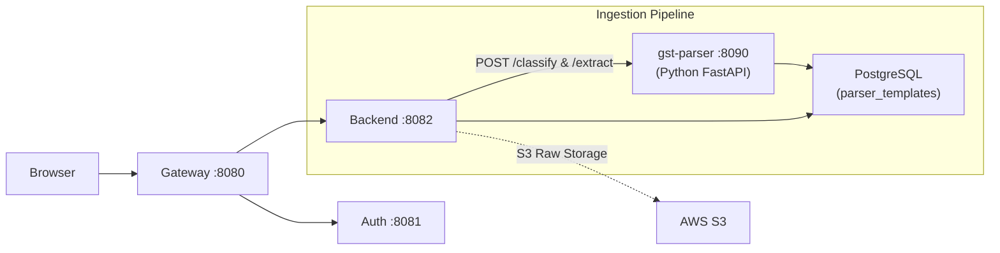

# Document Parser Sidecar — Implementation Plan

This is the finalized plan for the **Python FastAPI PDF/Excel Parser Sidecar**. It serves as a necessary component for Phase 1.1 (GSTR-1 Late Fee Engine, which needs the ARN Date extracted from the GSTR-1 PDF downloaded from the portal) and forms the foundation for all document ingestion in future phases.

## Strategic Goal
Implement a **Deterministic Extraction Pipeline** that avoids LLM hallucinations by using spatial anchoring/regex (for PDFs) and alias mapping (for Excels).

---

## 1. Architecture & Service Topology



### Deployment (Single EC2 for now, Scalable)
- **Tech Stack**: Python 3.12, FastAPI, Uvicorn (async workers).
- **Placement**: Same EC2 instance (local loopback) for minimal latency and security.
- **Port**: `8090`.
- **Scaling**: 
  - FastAPI `uvicorn` can run with multiple workers, capable of handling concurrent requests efficiently.
  - Future scale-out: Java config simply updates `parser.service.url` from `localhost:8090` to an ALB endpoint like `http://parser-alb:80`.
- **Isolation**: Parser crashes/resource spikes (e.g., complex PDFs/Excels) won't crash the main Java API.

---

## 2. Document Scope

**All NEW document parsing goes through Python.** Excels previously handled (Rule 37 Creditor ledger) remain in Java.

| Document | Parser | Rationale |
|----------|---------------|-----------|
| **GSTR-1/3B PDF** | Python | Needs PyMuPDF text extraction (3-5x faster than Java PDFBox). Extracts ARN, ARN Date, filing status, and table totals. |
| **GSTR-1/2A JSON** | Python | Trivial to parse in either, but keeping all portal downloads in one service normalizes the pipeline. |
| **GSTR-2A/2B Excel** *(Phase 2)* | Python | Needs alias mapping (Tally/Busy/portal variations)—`pandas` handles this easily. |
| **Creditor Ledger** *(Rule 37)* | Java `LedgerExcelParser` | Already works in production. No need to touch it. |

---

## 3. The 4-Stage Extraction Pipeline

```
File In → [1. Classify] → [2. Route] → [3. Extract] → [4. Validate] → JSON Out
```

1. **Classifier (Fingerprinting)**: Matches binary/text markers (e.g., `"FORM GSTR-1"` + `"[See rule 59(1)]"`) against a registry to figure out the document type.
2. **Router**: Dispatches to the right extraction engine based on classification.
3. **Engines**:
    - **PDF Engine**: Uses PyMuPDF (`fitz`) and regex for deterministic, anchor-based extraction (e.g., `ARN date\n(\d{2}/\d{2}/\d{4})`).
    - **JSON Engine**: Maps portal JSON keys to standard domain models.
    - **Excel Engine**: Scheduled for Phase 2.
4. **Validator**: Post-extraction sanity checks (e.g., valid GSTIN checksums, date range checks).

---

## 4. WORM Storage (Java Side)

**Write-Once, Read-Many (WORM)** pattern ensures auditability.

**S3 / Local Filesystem**:
- Raw Document is saved to S3 Standard-IA (or a local filesystem emulator for dev) with `tenant_id` prefix.

**PostgreSQL**:
- Parsed results are stored in PostgreSQL as `JSONB` for fast querying.
- Table `parsed_documents` links the S3 object key with the parsed JSON.

---

## 5. Proposed Changes: Component Implementation

### 5.1 The Python Codebase (`gst-parser/`)
A clean, modular directory mapping to the pipeline steps:

```text
gst-parser/
├── main.py                    # FastAPI entrypoint, routes (/extract, /health)
├── classifier/
│   └── classifier.py          # Stage 1: File/Content fingerprinting
├── engines/
│   ├── base.py                # BaseExtractor
│   ├── gstr1_pdf.py           # Engine for GSTR-1 PDFs
│   ├── gstr3b_pdf.py          # Engine for GSTR-3B PDFs
│   └── json_engine.py         # Engine for portal JSON downloads
├── validators/
│   ├── gstin.py               # Checksums and state codes validation
│   └── dates.py               # Date/Period normalization
├── requirements.txt           # fastapi, uvicorn, PyMuPDF, pydantic, python-multipart
└── Dockerfile                 # For containerized deployment
```

### 5.2 Java Backend Integration (`backend-service`)

#### [NEW] `com.learning.backendservice.infra.parser.ParserClient`
- A Spring `RestClient` wrapper targeting `http://localhost:8090/api/v1/extract`.
- DTOs: `ParsedDocumentResponse`, `ParserError`.

#### [NEW] `com.learning.backendservice.domain.ingestion.ParserOrchestrator`
- Higher-level wrapper handling the full ingestion flow:
  1. Upload raw file to S3.
  2. Call `ParserClient.extract`.
  3. Log result to `parsed_documents` DB table (linked to S3 key).

#### [NEW] `V3__parser_infra_seeds.sql`
- SQL migration adding:
  - `parser_templates` table to hold classification fingerprints (e.g., GSTR-1, GSTR-3B).
  - `parsed_documents` table to map S3 keys to `JSONB` output.

#### [NEW] `docker-compose.parser.yml`
- Docker compose override file for local testing of the Python sidecar.

---

## 6. Verification Plan

### Automated Testing
- **Python Unit Tests**: Provide sample PDFs from `resources/PROJECT GST/RAW RETURN/` to test classification accuracy and boundary value extraction (especially ARN date).
- **Java Integrations**: Test `ParserClient` mapping against mock JSON responses ensuring robust error handling of 422/500 responses from the sidecar.
- **GSTIN Validator**: Test state codes and checksum validations.

### Manual Verification
- Upload the provided `GSTR1_*.pdf` and `GSTR3B_*.pdf` from the test data and verify if the `ARN` and `ARN Date` surface accurately in the backend DB.
- Ensure the Python service automatically restarts when it encounters a catastrophic crash during local dev.
