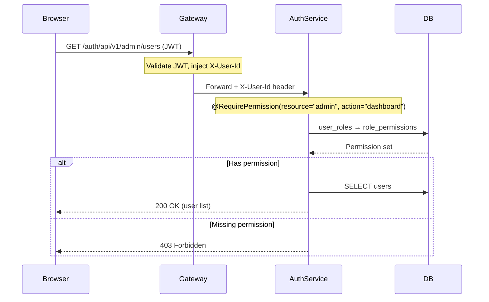
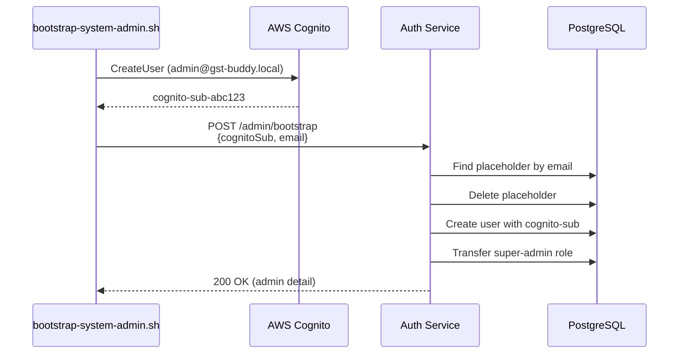

# Super-Admin Panel

**Version:** 1.0
**Last Updated:** 2026-02-22

The Super-Admin Panel provides platform-wide management capabilities for users holding the `super-admin` role. It covers user lifecycle management, credit operations, and pricing plan configuration — all accessible through a dedicated frontend UI and a permission-protected REST API.

---

## Overview

| Capability | Description |
|---|---|
| **Dashboard** | Aggregate KPIs — total users, credits granted/consumed, revenue, active plans |
| **User Management** | List, search, enable, suspend, delete any user; assign/remove roles |
| **Credit Operations** | View any user's wallet and transaction history; grant or revoke credits |
| **Plan Management** | CRUD pricing plans; activate/deactivate plans; set trial flags |
| **System Bootstrap** | One-time linking of Cognito identity to seeded system admin record |

---

## Architecture

### Authorization Model (RBAC)

The admin panel is protected by a two-layer authorization model:

```
Frontend Guard (JWT custom:role) → Backend AOP Aspect (@RequirePermission)
```

**Layer 1 — Frontend (`adminGuard`)**
- Reads `custom:role` claim from the Cognito JWT ID token.
- Only users with `custom:role = super-admin` can access `/app/admin/*` routes.
- Non-admins are redirected to `/app/dashboard`.

**Layer 2 — Backend (`AuthorizationAspect`)**
- AOP `@Around` advice intercepts every method annotated with `@RequirePermission`.
- Reads the caller's `X-User-Id` header (injected by the Gateway).
- Resolves the user's effective permissions: `user_roles → role_permissions → permissions`.
- Throws `PermissionDeniedException` if the required `resource:action` pair is missing.



### Permission Catalogue

| Permission ID | Used By |
|---|---|
| `admin:dashboard` | Dashboard stats, roles list |
| `user:read` | List users, get user detail |
| `user:manage` | Enable, suspend, delete users |
| `credit:read` | View wallets, transaction history |
| `credit:manage` | Grant/revoke credits |
| `plan:manage` | Create, update, toggle plans |
| `account:suspend` | Suspend user accounts |
| `account:delete` | Delete user accounts |

The `super-admin` role is seeded with **all** permissions above.

---

## System Admin Bootstrap

### Problem
The database is seeded (via Flyway migration `V1__authorization_schema.sql`) with a placeholder user `SYSTEM_ADMIN_PLACEHOLDER` that holds the `super-admin` role. This placeholder has no real Cognito identity.

### Solution
A one-time bootstrap process links a real Cognito user to the seeded record:

```
scripts/bootstrap-system-admin.sh
```

**What the script does:**

1. Creates (or updates) a Cognito user with `custom:role=super-admin`.
2. Sets a temporary password and forces it to be permanent.
3. Retrieves the Cognito `sub` (unique user ID).
4. Calls `POST /auth/api/v1/admin/bootstrap` with `{ cognitoSub, email }`.
5. The backend transfers roles from the placeholder to the real Cognito-linked user.

**Endpoint protection:** The bootstrap endpoint is protected by an internal API key (`X-Internal-Api-Key` header), not by JWT — because the admin doesn't have a valid session yet at bootstrap time.



### Configuration

| Variable | Default | Purpose |
|---|---|---|
| `PROJECT_NAME` | `gst-buddy` | Cognito user pool lookup prefix |
| `ENVIRONMENT` | `dev` | Environment suffix |
| `AUTH_SERVICE_URL` | `http://localhost:8081/auth` | Auth service base URL |
| `INTERNAL_API_KEY` | `dev-internal-key-change-me` | Bootstrap endpoint auth key |
| `ADMIN_EMAIL` | `system-admin@gst-buddy.local` | Admin account email |
| `ADMIN_PASSWORD` | `Admin@123456` | Initial password |

---

## API Reference

All endpoints are prefixed with `/auth/api/v1/admin/` and require a valid JWT with `super-admin` permissions (except bootstrap).

### Dashboard

| Method | Path | Permission | Description |
|---|---|---|---|
| `GET` | `/dashboard/stats` | `admin:dashboard` | Aggregate platform statistics |
| `GET` | `/dashboard/roles` | `admin:dashboard` | List all available roles |

### User Management

| Method | Path | Permission | Description |
|---|---|---|---|
| `GET` | `/users` | `user:read` | List all users (paginated, filterable) |
| `GET` | `/users/{userId}` | `user:read` | Get user detail (profile, roles, wallet) |
| `POST` | `/users/{userId}/enable` | `user:manage` | Set user status to ACTIVE |
| `POST` | `/users/{userId}/suspend` | `account:suspend` | Set user status to DISABLED |
| `DELETE` | `/users/{userId}` | `account:delete` | Permanently delete user and roles |
| `POST` | `/users/{userId}/roles` | `user:manage` | Assign a role to user |
| `DELETE` | `/users/{userId}/roles/{roleId}` | `user:manage` | Remove a role from user |

### Credit Operations

| Method | Path | Permission | Description |
|---|---|---|---|
| `GET` | `/credits/{userId}/transactions` | `credit:read` | Transaction history for a user |
| `POST` | `/credits/{userId}/grant` | `credit:manage` | Grant credits to user |
| `POST` | `/credits/{userId}/revoke` | `credit:manage` | Revoke credits from user |

### Plan Management

| Method | Path | Permission | Description |
|---|---|---|---|
| `GET` | `/plans` | `plan:manage` | List all plans (including inactive) |
| `POST` | `/plans` | `plan:manage` | Create a new pricing plan |
| `PUT` | `/plans/{planId}` | `plan:manage` | Update an existing plan |
| `PATCH` | `/plans/{planId}/toggle` | `plan:manage` | Toggle plan active/inactive |

### Bootstrap (Internal)

| Method | Path | Protection | Description |
|---|---|---|---|
| `POST` | `/bootstrap` | `X-Internal-Api-Key` | Link Cognito sub to seeded admin |

---

## Frontend Pages

All admin pages are nested under `/app/admin/` and protected by `adminGuard`.

### Sidebar Navigation
Super-admin users see an "Administration" section in the sidebar with links to:
- Admin Dashboard
- Manage Users
- Manage Plans
- Credit Overview

### Admin Dashboard (`/app/admin/dashboard`)
- Four KPI cards: Total Users, Credits Granted, Total Revenue, Active Plans.
- Each card shows contextual sub-metrics (active/disabled count, consumed count, etc.).
- Quick action buttons linking to management pages.

### User Management (`/app/admin/users`)
- Searchable, filterable data table with sortable columns.
- Inline actions: Enable, Suspend, Delete (with confirmation dialogs).
- Status badges and role tags per user.
- Click-through to user detail page.

### User Detail (`/app/admin/users/:userId`)
- Full user profile: avatar, email, status, join date, last login.
- **Role management:** Assign/remove roles via dialog.
- **Credit wallet:** Total, used, remaining display with Grant/Revoke dialog.
- **Transaction history:** Paginated table showing all credit movements.

### Plan Management (`/app/admin/plans`)
- Card grid showing all pricing plans.
- Each card: display name, slug, price, credits, validity, trial badge.
- Create/Edit dialog with full form validation.
- Activate/Deactivate toggle per plan.

### Credit Overview (`/app/admin/credits`)
- Summary KPI cards: Total Granted, Total Consumed, Outstanding Balance, Transaction count.
- Per-user wallet breakdown table with search and sorting.
- Click-through to user detail for individual management.

---

## Design Decisions

| Decision | Rationale |
|---|---|
| AOP-based `@RequirePermission` instead of Spring Security method security | Simpler integration with existing gateway-based auth; no need for SecurityContext |
| JWT `custom:role` claim for frontend guard | Avoids extra API call; role is injected by Cognito PreTokenGeneration Lambda |
| Seeded placeholder + bootstrap pattern | Ensures super-admin role exists before any Cognito user; supports DB-first provisioning |
| Admin routes nested under `/app/admin/` (not separate app) | Single deployment; reuses existing layout, auth interceptor, and session |
| Component-level `MessageService` in PrimeNG | Required by PrimeNG toast/confirm components; spied via `debugElement.injector` in tests |

---

## Testing

### Backend (29 unit tests)

| Test Class | Tests |
|---|---|
| `AuthorizationServiceTest` | 9 — permission resolution, super-admin check, role lookup |
| `AdminUserServiceTest` | 14 — user CRUD, role assignment (idempotent), bootstrap (transfer + already linked) |
| `AdminCreditServiceTest` | 6 — dashboard stats aggregation, transaction history, credit grant delegation |

### Frontend (64 unit tests)

| Test File | Tests |
|---|---|
| `admin.guard.spec.ts` | 3 — super-admin allowed, guest redirected, non-admin redirected |
| `admin-api.service.spec.ts` | 16 — all 17 API methods, HTTP verbs, params, request bodies |
| `admin-dashboard.component.spec.ts` | 6 — init, stats, error handling, formatting, navigation |
| `admin-users.component.spec.ts` | 10 — init, search, filter, enable, error toast, status severity |
| `admin-user-detail.component.spec.ts` | 11 — init, role assign/remove, credit grant/revoke, error handling |
| `admin-plans.component.spec.ts` | 10 — init, create/edit, save, toggle, form validation |
| `admin-credits.component.spec.ts` | 7 — init, search, filter, formatting, error handling |
