# System Architecture

**Version:** 7.2 (Extracted from HLD)
**Last Updated:** 2026-01-17

This document details the microservices architecture, component responsibilities, and request flows of the SaaS Foundation.

---

## 🏗️ High-Level Architecture

```mermaid
graph TB
    subgraph "Client Layer"
        WebApp[🌐 Angular Web App]
        User[👤 End Users]
    end
    
    subgraph "Entry Point"
        ALB[AWS ALB]
    end
    
    subgraph "Microservices"
        Gateway[🛡️ Gateway Service]
        Auth[🔐 Auth Service]
        Backend[📦 Backend Service]
        Eureka[🔍 Eureka Server]
    end
    
    subgraph "AWS Services"
        Cognito[Cognito]
        RDS[RDS PostgreSQL]
        SSM[SSM Parameter Store]
    end
    
    User --> WebApp
    WebApp --> ALB
    ALB --> Gateway
    Gateway --> Auth
    Gateway --> Backend
    Gateway -.- Eureka
```



---

## 📋 Service Roles & Responsibilities

### 🛡️ Gateway Service (Port 8080)
**Role:** Gatekeeper - Security boundary for ALL incoming requests.

- **Authentication:** Validates JWT tokens from Cognito. **Sole Validator**.
- **Tenant Context:** Extracts `X-Tenant-Id` from JWT/Headers.
- **Header Enrichment:** Injects `X-User-Id`, `X-Authorities` downstream.
- **Rate Limiting:** Redis-based limiting per tenant/IP.
- **Routing:** Dispatches requests to services via Eureka.

### 🔐 Auth Service (Port 8081)
**Role:** Identity, Permissions, Signup Orchestration, and Platform Administration.

- **User Management:** Wraps Cognito actions, manages user profiles.
- **RBAC:** Stores Roles, Permissions, and Role-Permission mappings. Enforced via AOP `@RequirePermission` annotation.
- **Signup Pipeline:** Orchestrates tenant creation, DB provisioning, and email verification.
- **Billing & Credits:** Manages Plans, User Wallets, and Credit Transactions.
- **Admin API:** Platform-wide super-admin endpoints for user lifecycle, credit operations, and plan management. See [Admin Panel](ADMIN_PANEL.md).


### 📦 Backend Service (Port 8082)
**Role:** Domain-specific business logic (GST Buddy).

- **Business Logic:** Rule 37 ledger upload, calculation, export; future GST rules.
- **Authorization:** Enforces `@RequirePermission` checks.
- **Credit Consumption:** Consumes credits via `CreditClient` (Auth Service) before processing.
- **Isolation:** Uses `TenantAware` entities to automatically filter data by `tenant_id` in shared database.


### 🔍 Eureka Server (Port 8761)
**Role:** Service Discovery.
- Services register here on startup (`http://eureka-server:8761/eureka`).
- Gateway queries Eureka to find service instances.

---

## 📡 API Request Flow (Production)

### 1. Simplified Flow
1. **User** sends request → **Gateway**
2. **Gateway** validates JWT & extracts Tenant ID.
3. **Gateway** injects headers: `X-Tenant-Id`, `X-User-Id`.
4. **Gateway** forwards to **Backend Service**.
5. **Backend** reads header → Sets Tenant Context → Queries **Shared DB** with `tenant_id` filter.
6. **Backend** executes logic & returns response.

### 2. Request Diagram


### 3. Admin API Flow


### 4. Security Boundaries
> [!IMPORTANT]
> **Gateway-as-Gatekeeper Principle**
> - **External Traffic**: MUST go through Gateway.
> - **Gateway**: The ONLY service that validates JWTs.
> - **Internal Services**: Trust `X-Tenant-Id` and `X-User-Id` headers from Gateway.
> - **Admin API**: Protected by `@RequirePermission` AOP aspect; requires `super-admin` role permissions.
> - **Network**: Internal services should not be exposed publicly.

---

## 🔍 Observability

The platform uses **OpenTelemetry** and **AWS X-Ray** for distributed tracing.

### Tracing Flow
1. **Gateway** receives request → Starts Trace ID.
2. **Services** propagate Trace ID (B3/W3C format).
3. **OTEL Collector** gathers spans.
4. **AWS X-Ray** visualizes the full request path.

### Configuration
```yaml
management:
  tracing:
    enabled: true
    sampling:
      probability: 1.0 # 100% in Dev
```
