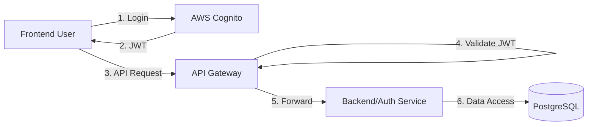

# Authentication & Security

## Overview
Cloud-Infra-Lite uses **AWS Cognito** for identity management and **Spring Cloud Gateway** for request validation. The architecture is simplified for a single-tenant SaaS application.

## Authentication Flow

1. **Signup/Login**: Users authenticate directly with AWS Cognito (User Pool) via the Frontend.
2. **Token Issuance**: Cognito returns an ID Token and Access Token.
3. **API Requests**: Frontend sends the **ID Token** in the `Authorization` header (`Bearer <token>`).
4. **Gateway Validation**:
   - Validates JWT signature against Cognito JWKS.
   - Checks token expiration.
   - Filters out spoofed headers.
   - Forwards request to downstream services (Auth Service, Backend Service).



## Security Components

### 1. API Gateway
- **JWT Validation**: Uses Spring Security OAuth2 Resource Server to validate tokens.
- **Header Sanitization**: Removes unsafe headers (`X-User-Id`, `X-Email`) from incoming requests to prevent spoofing.
- **Context Injection**: Extracts user claims (Subject, Email) from the verified JWT and injects them as trusted headers for downstream services.

### 2. Downstream Services (Backend/Auth)
- **Trust Boundary**: Accepts requests only from the Gateway (ensured via network policy/security groups).
- **User Context**: Reads `X-User-Id` and `X-Email` headers to identify the calling user.
- **Stateless**: No session state is maintained in the services.

## Configuration

### Cognito Setup (Terraform)
- **User Pool**: Manages users and groups.
- **App Client**: Used by the frontend for authentication.
- **Domain**: Hosted UI for login/signup (optional, if not using custom UI).

### Service Configuration
Services load Cognito configuration from AWS Systems Manager (SSM) Parameter Store at startup:
- `/gst-buddy/<env>/cognito/user_pool_id`
- `/gst-buddy/<env>/cognito/issuer_uri`
- `/gst-buddy/<env>/cognito/jwks_uri`

## Super-Admin Bootstrap

The platform ships with a seeded `super-admin` role in the database. To create the actual admin user:

1. Run `scripts/bootstrap-system-admin.sh` (requires AWS CLI configured).
2. The script creates a Cognito user with `custom:role=super-admin`.
3. It calls `POST /auth/api/v1/admin/bootstrap` to link the Cognito `sub` to the seeded DB record.
4. After bootstrap, the admin can log in and access `/app/admin/*` routes.

See [Admin Panel documentation](ADMIN_PANEL.md) for full details on the RBAC model, API endpoints, and frontend pages.

### Authorization Flow (RBAC)

```
JWT (custom:role) → Frontend adminGuard → Gateway (X-User-Id) → @RequirePermission AOP Aspect
                                                                    ↓
                                                          user_roles → role_permissions → permissions
```

- **Frontend**: `adminGuard` checks `custom:role === 'super-admin'` from the JWT.
- **Backend**: `AuthorizationAspect` resolves the user's effective permissions from the database and enforces `@RequirePermission(resource, action)` on each controller method.

## Testing
- **Local Development**: Use `scripts/bootstrap-system-admin.sh` to create the admin user in Cognito and link it to the database.
- **Postman**: Obtain a JWT from Cognito (via AWS CLI or helper script) and send it in the `Authorization` header.
- **Admin Access**: After bootstrap, log in with the admin credentials and navigate to `/app/admin/dashboard`.
