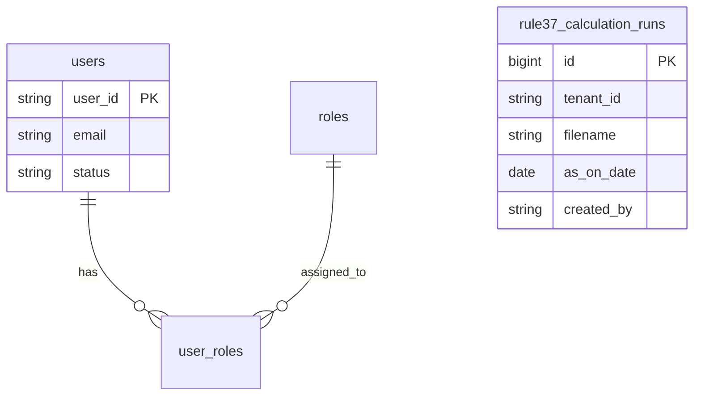

# Database Schema (Lite)

## Overview
The application uses a **Shared Database** pattern with a **Multi-Tenant** relational model using discriminator columns (`tenant_id`).

| Service | Database | Description |
|---------|----------|-------------|
| **Auth Service** | `gst-buddy` (schema: `public`) | User identities, roles, and permissions (if persisting locally) |
| **Backend Service** | `backendgst_buddy` (or shared `gst-buddy`) | Business data (Rule 37 calculation runs) |

> **Note:** For the "Lite" template, both services typically share the same PostgreSQL instance and can share the same database (`gst-buddy`) for simplicity, but strictly separate tables.

## 1. Auth Service Schema
Handles user identity metadata and role assignments.

### `users`
Local registry of users (synced from/linked to Cognito).

| Column | Type | Description |
|--------|------|-------------|
| `user_id` | VARCHAR(255) | **PK** - Cognito User ID (Sub) |
| `tenant_id` | VARCHAR(64) | **Discriminator** (Default: 'default') |
| `email` | VARCHAR(255) | User Email |
| `name` | VARCHAR(255) | Display Name |
| `status` | VARCHAR(32) | `ACTIVE`, `DISABLED` |
| `created_at` | TIMESTAMPTZ | Creation timestamp |

### `roles`
Predefined roles for the system.

| Column | Type | Description |
|--------|------|-------------|
| `id` | VARCHAR(64) | **PK** - `admin`, `editor`, `viewer` |
| `tenant_id` | VARCHAR(64) | **Discriminator** |
| `name` | VARCHAR(100) | Display name |

### `user_roles`
Maps users to roles.

| Column | Type | Description |
|--------|------|-------------|
| `id` | BIGSERIAL | **PK** |
| `tenant_id` | VARCHAR(64) | **Discriminator** |
| `user_id` | VARCHAR(255) | FK -> users.user_id |
| `role_id` | VARCHAR(64) | FK -> roles.id |

### Credit System (Billing)

### `plans`
Credit packages available for purchase.

| Column | Type | Description |
|--------|------|-------------|
| `id` | BIGSERIAL | **PK** |
| `name` | VARCHAR(50) | Unique internal name (trial, pro, ultra) |
| `display_name` | VARCHAR(100) | User-facing name |
| `credits` | INTEGER | Number of credits in this plan |
| `price_inr` | DECIMAL(10,2) | Cost in INR |
| `is_trial` | BOOLEAN | If true, auto-granted on signup |
| `active` | BOOLEAN | If false, plan is hidden |

### `user_credit_wallets`
Tracks available credits for each user.

| Column | Type | Description |
|--------|------|-------------|
| `id` | BIGSERIAL | **PK** |
| `user_id` | VARCHAR(255) | **Unique Index** - Owner of the wallet |
| `balance` | INTEGER | Current available credits (>= 0) |
| `version` | BIGINT | Optimistic locking version |

### `credit_transactions`
Audit log of all credit additions and deductions.

| Column | Type | Description |
|--------|------|-------------|
| `id` | BIGUUID | **PK** (UUID) |
| `wallet_id` | BIGINT | FK -> user_credit_wallets.id |
| `amount` | INTEGER | +/- change in credits |
| `type` | VARCHAR(20) | `PURCHASE`, `USAGE`, `TRIAL_GRANT`, `ADMIN_GRANT` |
| `reference_id` | VARCHAR(255) | Related entity ID (e.g., payment ID or calculation ID) |
| `reference_type` | VARCHAR(50) | `PAYMENT`, `LEDGER_ANALYSIS` |
| `description` | VARCHAR(255) | Human-readable description |
| `created_at` | TIMESTAMPTZ | Transaction timestamp |

---

## 2. Backend Service Schema
Stores business domain data.

### `rule37_calculation_runs` (Phase 1)
Rule 37 (180-day ITC reversal) calculation runs from ledger uploads.

| Column | Type | Description |
|--------|------|-------------|
| `id` | BIGSERIAL | **PK** |
| `tenant_id` | VARCHAR(64) | **Discriminator** |
| `filename` | VARCHAR(255) | Original ledger filename |
| `as_on_date` | DATE | Calculation as-on date |
| `total_interest` | DECIMAL(15,2) | Total interest payable |
| `total_itc_reversal` | DECIMAL(15,2) | Total ITC reversal |
| `calculation_data` | JSONB | LedgerResult[] — full calculation details |
| `created_at` | TIMESTAMPTZ | Creation timestamp |
| `created_by` | VARCHAR(255) | User ID (X-User-Id) who uploaded |
| `expires_at` | TIMESTAMPTZ | Retention expiry (default: created_at + 7 days) |

**Retention:** Configurable via `app.retention.days` (default 7). `RetentionScheduler` deletes expired runs.

## Entity Relationship Diagram

