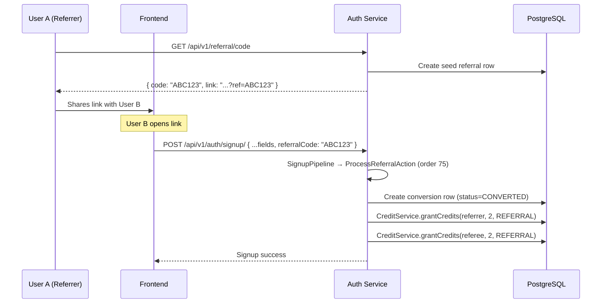

# 🤝 Referral System

**Last Updated:** 2026-02-28

## Overview

Users can invite friends via a unique referral code/link. When a new user signs up using the link, **both** the referrer and the referee receive configurable bonus credits.

## Flow

## API Endpoints

| Method | Endpoint | Auth | Description |
|--------|----------|------|-------------|
| `GET` | `/auth/api/v1/referral/code` | JWT | Get/generate referral code + shareable link |
| `GET` | `/auth/api/v1/referral/stats` | JWT | Referral stats (total, credits earned) |

## Configuration

| Property | Env Var | Default | Description |
|----------|---------|---------|-------------|
| `app.referral.reward-credits` | `APP_REFERRAL_REWARD_CREDITS` | `2` | Credits per successful referral |
| `app.referral.base-url` | `APP_REFERRAL_BASE_URL` | `http://localhost:4200/auth/signup` | Base URL for referral links |

## Key Design Decisions

| Decision | Rationale |
|----------|-----------|
| **Signup pipeline action** (order 75) | Open/Closed — no changes to `SignupPipeline` |
| **Non-blocking action** | Signup never fails due to referral errors |
| **Idempotent processing** | Duplicate referrals are silently skipped |
| **Self-referral prevention** | Validated server-side |
| **Separate `REFERRAL` ReferenceType** | Enables precise credit reporting vs generic `PROMO` |

## Database

Table: `referrals` (in `V1__authorization_schema.sql`)

| Column | Type | Description |
|--------|------|-------------|
| `id` | `BIGSERIAL` | PK |
| `referrer_user_id` | `VARCHAR(255)` | User who shared the code |
| `referee_user_id` | `VARCHAR(255)` | NULL for seed row; populated on conversion |
| `referral_code` | `VARCHAR(20)` | 8-char alphanumeric code |
| `status` | `VARCHAR(20)` | `ACTIVE`, `CONVERTED`, `EXPIRED` |
| `converted_at` | `TIMESTAMPTZ` | When conversion happened |

## Files

| File | Purpose |
|------|---------|
| `referral/entity/Referral.java` | JPA entity |
| `referral/entity/ReferralStatus.java` | Status enum |
| `referral/repository/ReferralRepository.java` | Data access |
| `referral/service/ReferralService.java` | Interface |
| `referral/service/ReferralServiceImpl.java` | Implementation |
| `referral/controller/ReferralController.java` | REST API |
| `referral/config/ReferralProperties.java` | Config properties |
| `referral/dto/ReferralCodeDto.java` | Code response DTO |
| `referral/dto/ReferralStatsDto.java` | Stats response DTO |
| `signup/actions/ProcessReferralAction.java` | Pipeline action |
