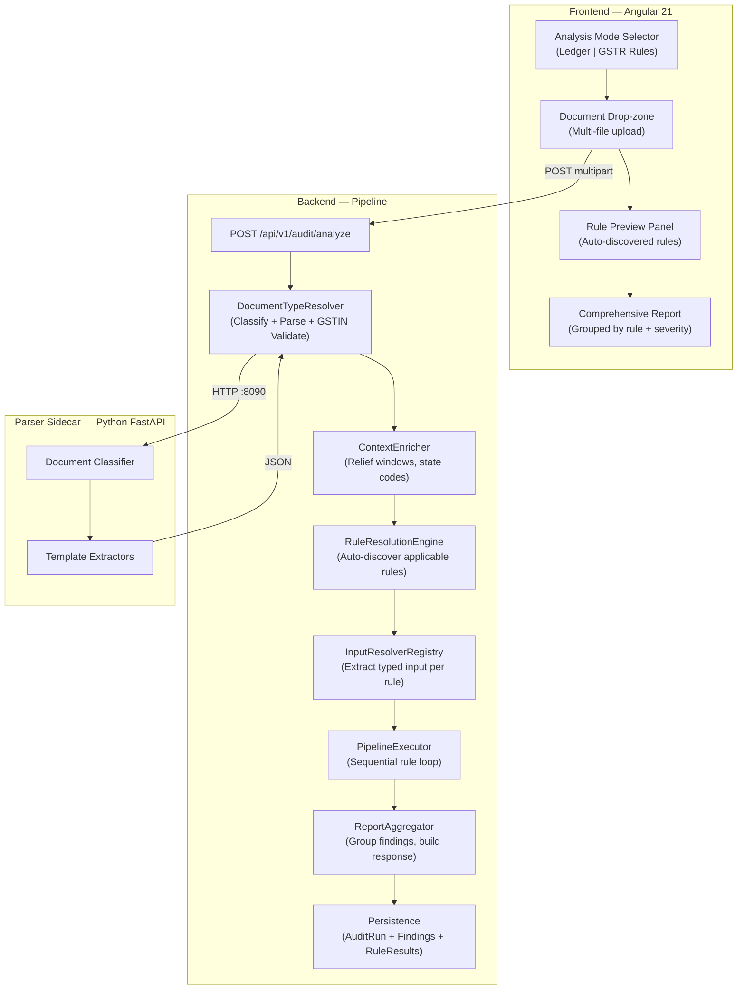

# Document-Centric Audit Pipeline — HLD + LLD (v2)

**Goal**: Transform from rule-centric (user picks one rule → one file → one result) to document-centric (user picks analysis mode → uploads documents → system auto-discovers all applicable rules → generates comprehensive compliance report).


---

## 🚀 Implementation Progress — Phase A

> Last updated: 19-04-2026

### Phase A: Pipeline Foundation

- `[x]` **A1** — `DocumentType` + `AnalysisMode` enums [NEW]
- `[x]` **A2** — `AuditDocument` + `AuditUserParams` + `SharedResources` records [NEW]
- `[x]` **A3** — `AuditContext` evolution — add documents, userParams, sharedResources, stateCode [MODIFY]
- `[x]` **A4** — `AuditRule` — add 4 default methods (zero breaking changes) [MODIFY]
- `[x]` **A5** — `InputResolver<I>` interface + `InputResolverRegistry` [NEW]
- `[x]` **A6** — `RuleResolutionEngine` [NEW]
- `[x]` **A7** — `ContextEnricher` [NEW]
- `[x]` **A8** — `PipelineExecutor` + `PipelineResult` + `RuleExecutionResult` records [NEW]
- `[x]` **A9** — `AuditRunOrchestrator.analyzeDocuments()` — unified entry point [MODIFY]
- `[x]` **A10** — `AuditAnalyzeController` — `POST /api/v1/audit/analyze` [NEW]
- `[x]` **A11** — Flyway `V5__pipeline_architecture.sql` (migrate + drop `rule_id`) [NEW]
- `[x]` **A12** — `AuditRun` entity — add `rulesExecuted`, `analysisMode`; `AuditRunRuleResult` entity [MODIFY/NEW]
- `[x]` **A13** — `Rule37AuditRule` + `Gstr1LateFeeAuditRule` overrides [MODIFY]
- `[x]` **A14** — `Rule37InputResolver` + `Gstr1LateFeeInputResolver` [NEW]
- `[x]` **A15** — Old controllers deleted; frontend services redirected to `/api/v1/audit/analyze` [REMOVE]
- `[x]` **A16** — Unit tests: `RuleResolutionEngineTest` (6), `PipelineExecutorTest` (5), `InputResolverRegistryTest` (5) — 27 total, all green

---

## 🚀 Implementation Progress — Phase B

> Last updated: 19-04-2026

### Phase B: GSTR-3B + GSTR-9 Rules

- `[x]` **B1** — `Gstr3bLateFeeAuditRule` + domain types + calculator service + `Gstr3bLateFeeInputResolver` — 12 tests green [NEW]
- `[/]` **B2** — `Gstr3bInterestAuditRule` + `Gstr3bInterestInputResolver` [NEW]
- `[ ]` **B3** — `Gstr9LateFeeAuditRule` + domain types + calculator + `Gstr9LateFeeInputResolver` [NEW]
- `[ ]` **B4** — Frontend: Analysis mode selector + comprehensive report view [MODIFY]

---

## GST Expert Review — Gaps Found & Fixed

### Gap 1: Type-Safety Violation (CRITICAL)

**Problem**: The v1 plan proposed casting all rules to `AuditRule<AuditContext, ?>`, destroying the existing type-safe contract. `Rule37AuditRule` takes `List<MultipartFile>`, `Gstr1LateFeeAuditRule` takes `Gstr1LateFeeInput` — forcing them to accept `AuditContext` as input breaks the Strategy pattern.

**Fix**: Introduce `InputResolver<I>` — a companion strategy that extracts rule-specific input from the `AuditContext`. Each rule declares its resolver. The pipeline calls `resolver.resolve(context)` → passes result to `rule.execute(input, context)`.

### Gap 2: User-Supplied Parameters Per Rule

**Problem**: The current GSTR-1 flow requires `isQrmp` and `isNilReturn` from the CA. In a multi-rule pipeline, these params must flow to the right rule. The v1 plan had `Map<String, Object> userParams` — completely untyped.

**Fix**: `userParams` is typed as `AuditUserParams` record. The `InputResolver` is responsible for extracting the relevant subset. The frontend sends structured params per document type, not per rule.

### Gap 3: Multi-Period Uploads

**Problem**: A CA might upload 12 months of GSTR-3B at once. Each PDF contains its own `tax_period`. The plan assumed a single `asOnDate` / `financialYear`. But GSTR-3B for Apr-2024 and Mar-2025 belong to different FYs.

**Fix**: `asOnDate` remains (it's the "evaluate as of" date for risk assessment). Each `AuditDocument` carries its own `taxPeriod` (extracted by the parser). Rules operate on per-document tax period, not the global asOnDate. Multi-period uploads generate findings grouped by period.

### Gap 4: Relief Window Resolution

**Problem**: Currently the orchestrator pre-resolves relief windows from the DB *before* calling the rule (good pattern — keeps rules DB-free). The pipeline must preserve this pattern across all rules.

**Fix**: `ContextEnricher` — a pre-pipeline step that loads all shared DB resources (relief windows, state codes, GSTIN status cache) into `AuditContext.sharedResources()`. Typed, not `Map<String, Object>`.

### Gap 5: GSTIN Validation at Ingestion

**Problem**: GSTIN validation (Modulo-11) must happen *early* — at document ingestion, not deferred to rules. An invalid GSTIN wastes pipeline execution on bad data.

**Fix**: `DocumentTypeResolver` validates GSTIN during parsing. Invalid GSTIN = immediate rejection with clear error citing the checksum failure.

### Gap 6: State-Dependent Due Dates

**Problem**: GSTR-3B due dates vary by state (22nd vs 24th for QRMP — Category A vs B, Notification 76/2020-CT). The pipeline needs the taxpayer's state code (from GSTIN positions 0-1) to compute correct due dates per Section 47(2).

**Fix**: `AuditContext` carries `stateCode` extracted from GSTIN during document parsing. Rules that need state-aware due dates access `context.stateCode()`.

### Gap 7: Section 50 Interest Runs Parallel to Late Fee

**Problem**: Per GST law, interest under Section 50(1) runs **parallel** to late fee under Section 47. They are independent liabilities. The pipeline must execute both independently — never conflate.

**Fix**: Late fee and interest are separate rules with separate execution priorities. `Gstr3bLateFeeAuditRule` (order=10) runs independently of `Gstr3bInterestAuditRule` (order=20). Both produce independent `AuditFinding` records. The report shows them as separate line items.

---

## 1. High-Level Design (HLD)

### 1.1 Architecture Overview



### 1.2 Analysis Modes

| Mode | Input | Rules Auto-Discovered | User Params |
|---|---|---|---|
| **Ledger Analysis** | Excel purchase ledger | Rule 37 only | `asOnDate` |
| **GSTR Rules Analysis** | GSTR-1/3B/9/2B PDFs or JSON | All applicable rules from uploaded doc set | `asOnDate`, `isQrmp`, `isNilReturn` (per doc type) |

### 1.3 SOLID Principles — Concrete Application

| Principle | Where Applied | How |
|---|---|---|
| **S** — SRP | `AuditRule` = one compliance check. `InputResolver` = input extraction. `ContextEnricher` = DB lookups. `PipelineExecutor` = orchestration. | Each class has exactly one reason to change. |
| **O** — OCP | `AuditRuleRegistry` + `InputResolverRegistry` | New rules = new `@Component`. Zero changes to pipeline/orchestrator code. |
| **L** — LSP | All `AuditRule<I, O>` implementations | Any rule can be substituted in the pipeline loop. |
| **I** — ISP | `AuditRule` interface default methods | Rules only override what they need. `getRequiredDocumentTypes()`, `canExecute()`, `getExecutionOrder()` — all have sensible defaults. |
| **D** — DIP | `PipelineExecutor` → `AuditRule` interface | Executor depends on abstraction, never imports concrete rule classes. |

---

## 2. Low-Level Design (LLD)

### 2.1 New Types

---

#### `DocumentType` enum [NEW]

```java
package com.learning.backendservice.engine;

public enum DocumentType {
    PURCHASE_LEDGER,   // Excel — Rule 37 input
    GSTR_1,            // PDF/JSON — Section 47(1), POS, recon
    GSTR_3B,           // PDF/JSON — Section 47(2), Section 50, RCM, Rule 86B
    GSTR_9,            // PDF/JSON — Section 47(2), reconciliation
    GSTR_9C,           // PDF/JSON — filed with GSTR-9
    GSTR_2A,           // PDF/JSON — supplier risk scoring
    GSTR_2B,           // PDF/JSON — ITC matching, Section 16(4)
    PURCHASE_REGISTER  // Excel — ITC reco, RCM reco
}
```

> Yes — GSTR_RULES_ANALYSIS covers **all** GST return-based rules. Any PDF/JSON from the GST portal (GSTR-1, 3B, 9, 2A, 2B) is a valid input. The system auto-discovers which rules apply based on what documents are present. The more documents uploaded, the more rules fire (including cross-document reconciliation rules).

---

#### `AnalysisMode` enum [NEW]

```java
package com.learning.backendservice.engine;

public enum AnalysisMode {
    LEDGER_ANALYSIS,      // Rule 37 — Excel purchase ledger
    GSTR_RULES_ANALYSIS   // All GST return-based rules — auto-discovered
}
```

---

#### `AuditDocument` record [NEW]

```java
package com.learning.backendservice.engine;

import java.time.YearMonth;
import java.util.Map;

/**
 * A parsed document within the audit context.
 * Created by DocumentTypeResolver after classification and parsing.
 *
 * @param documentType      classified document type
 * @param originalFilename  original upload filename
 * @param parsedJson        raw parsed JSON from Python sidecar (null for ledgers)
 * @param extractedFields   typed key fields (gstin, arnDate, taxPeriod, etc.)
 * @param taxPeriod         tax period this document belongs to (from parser)
 * @param gstin             GSTIN extracted from the document (validated Modulo-11)
 */
public record AuditDocument(
    DocumentType documentType,
    String originalFilename,
    String parsedJson,
    Map<String, Object> extractedFields,
    YearMonth taxPeriod,
    String gstin
) {}
```

---

#### `AuditUserParams` record [NEW]

Typed user-supplied parameters (replaces `Map<String, Object>`).

```java
package com.learning.backendservice.engine;

/**
 * User-supplied parameters for the analysis run.
 * Sent by the frontend alongside file uploads.
 *
 * @param isQrmp           QRMP filer (affects GSTR-1/3B due dates)
 * @param isNilReturn      Nil return (affects late fee caps)
 * @param aggregateTurnover Annual turnover (affects GSTR-9 exemption threshold)
 * @param stateCode        Override state code (if CA is running for a different state)
 */
public record AuditUserParams(
    boolean isQrmp,
    boolean isNilReturn,
    java.math.BigDecimal aggregateTurnover,
    String stateCode
) {
    public static AuditUserParams defaults() {
        return new AuditUserParams(false, false, null, null);
    }
}
```

---

#### `SharedResources` record [NEW]

Pre-loaded DB resources — typed, not `Map<String, Object>`.

```java
package com.learning.backendservice.engine;

import com.learning.backendservice.domain.gstr1.ReliefWindowSnapshot;
import java.util.List;
import java.util.Map;

/**
 * Pre-loaded shared resources for the pipeline.
 * Loaded by ContextEnricher from the DB before rule execution.
 * Rules access these via AuditContext — no direct DB access.
 */
public record SharedResources(
    Map<String, List<ReliefWindowSnapshot>> reliefWindowsByReturnType,
    // Key: "GSTR_1_NIL", "GSTR_1_NON_NIL", "GSTR_3B_NIL", etc.
    Map<String, String> stateCodeLookup
    // Future: GSTIN status cache, rate tables, etc.
) {
    public static SharedResources empty() {
        return new SharedResources(Map.of(), Map.of());
    }
}
```

---

#### `AuditContext` [MODIFY] — Add document basket + typed resources

```java
package com.learning.backendservice.engine;

import java.time.LocalDate;
import java.util.*;
import java.util.stream.Collectors;

/**
 * Immutable execution context for the audit pipeline.
 * Extended from the original to support multi-document, multi-rule execution.
 */
public record AuditContext(
    String tenantId,
    String userId,
    String financialYear,
    LocalDate asOnDate,
    AnalysisMode analysisMode,
    List<AuditDocument> documents,
    AuditUserParams userParams,
    SharedResources sharedResources,
    String stateCode  // positions 0-1 of primary GSTIN, e.g. "29" for Karnataka
) {
    // Existing helpers preserved
    public static String deriveFinancialYear(LocalDate date) {
        int year = date.getMonthValue() >= 4 ? date.getYear() : date.getYear() - 1;
        return year + "-" + String.format("%02d", (year + 1) % 100);
    }

    // Backward-compat factory for existing code
    public static AuditContext of(String tenantId, String userId, LocalDate asOnDate) {
        return new AuditContext(tenantId, userId, deriveFinancialYear(asOnDate),
            asOnDate, AnalysisMode.LEDGER_ANALYSIS, List.of(),
            AuditUserParams.defaults(), SharedResources.empty(), null);
    }

    // New pipeline factory
    public static AuditContext forAnalysis(
            String tenantId, String userId, LocalDate asOnDate,
            AnalysisMode mode, List<AuditDocument> documents,
            AuditUserParams params, SharedResources resources) {
        String stateCode = documents.stream()
            .map(AuditDocument::gstin)
            .filter(g -> g != null && g.length() >= 2)
            .map(g -> g.substring(0, 2))
            .findFirst().orElse(null);

        return new AuditContext(tenantId, userId, deriveFinancialYear(asOnDate),
            asOnDate, mode, List.copyOf(documents), params, resources, stateCode);
    }

    public Optional<AuditDocument> getDocument(DocumentType type) {
        return documents.stream()
            .filter(d -> d.documentType() == type)
            .findFirst();
    }

    public List<AuditDocument> getDocuments(DocumentType type) {
        return documents.stream()
            .filter(d -> d.documentType() == type)
            .toList();
    }

    public boolean hasDocument(DocumentType type) {
        return documents.stream().anyMatch(d -> d.documentType() == type);
    }

    public Set<DocumentType> getAvailableDocumentTypes() {
        return documents.stream()
            .map(AuditDocument::documentType)
            .collect(Collectors.toUnmodifiableSet());
    }
}
```

---

#### `AuditRule<I, O>` interface [MODIFY] — Add default methods

All new methods have defaults — **fully backward-compatible** with existing `Rule37AuditRule` and `Gstr1LateFeeAuditRule`.

```java
// ADD to existing AuditRule.java — new default methods only

/**
 * Document types required for this rule. Used by RuleResolutionEngine.
 * Override for GSTR rules. Legacy rules (Rule 37) return empty → use mode-based filtering instead.
 */
default Set<DocumentType> getRequiredDocumentTypes() {
    return Set.of();
}

/**
 * Analysis modes this rule applies to.
 * Default: GSTR_RULES_ANALYSIS. Override for Rule 37.
 */
default Set<AnalysisMode> getApplicableModes() {
    return Set.of(AnalysisMode.GSTR_RULES_ANALYSIS);
}

/**
 * Whether this rule can execute given the current context.
 * Default: all required document types present.
 * Override for rules with extra preconditions (FY-specific, turnover threshold, etc.).
 */
default boolean canExecute(AuditContext context) {
    return context.getAvailableDocumentTypes().containsAll(getRequiredDocumentTypes());
}

/**
 * Execution priority within the pipeline.
 * Lower value = runs earlier. Used to ensure ordering dependencies.
 *
 * Guide:
 *   0-9   = Pre-checks (GSTIN validation, data quality)
 *   10-19 = Late fee rules (Section 47)
 *   20-29 = Interest rules (Section 50) — run AFTER late fee (parallel liability, independent)
 *   30-39 = Deadline guards (Section 16(4))
 *   40-49 = Restriction checks (Rule 86B)
 *   50-59 = Reconciliation rules (cross-document)
 *   60-69 = Supplier risk (external lookups)
 *   100   = Default
 */
default int getExecutionOrder() {
    return 100;
}
```

---

#### `InputResolver<I>` interface [NEW] — Type-safe input extraction

The critical piece that preserves type safety. Each rule has a companion resolver.

```java
package com.learning.backendservice.engine;

/**
 * Extracts rule-specific typed input from the generic AuditContext.
 *
 * <p>Each AuditRule<I, O> has a companion InputResolver<I> that knows
 * how to build the rule's specific input type from the shared context.
 * This preserves type safety — the pipeline never casts.
 *
 * <p>Registered as @Component, discovered by InputResolverRegistry.
 *
 * @param <I> the input type matching the rule's AuditRule<I, O>
 */
public interface InputResolver<I> {

    /** The rule ID this resolver serves. Must match AuditRule.getRuleId(). */
    String getRuleId();

    /**
     * Build the typed input from the audit context.
     * May access context.documents(), context.userParams(), context.sharedResources().
     * Must NOT access the database directly.
     */
    I resolve(AuditContext context);
}
```

**Example — GSTR-1 Late Fee Input Resolver:**

```java
@Component
public class Gstr1LateFeeInputResolver implements InputResolver<Gstr1LateFeeInput> {

    @Override
    public String getRuleId() { return "LATE_FEE_GSTR1"; }

    @Override
    public Gstr1LateFeeInput resolve(AuditContext context) {
        AuditDocument doc = context.getDocument(DocumentType.GSTR_1)
            .orElseThrow(() -> new IllegalStateException("GSTR-1 document required"));

        Map<String, Object> fields = doc.extractedFields();
        LocalDate arnDate = LocalDate.parse(String.valueOf(fields.get("arn_date")));
        YearMonth taxPeriod = doc.taxPeriod();

        // Resolve relief window from pre-loaded shared resources
        String appliesTo = context.userParams().isNilReturn() ? "NIL" : "NON_NIL";
        List<ReliefWindowSnapshot> windows = context.sharedResources()
            .reliefWindowsByReturnType()
            .getOrDefault("GSTR_1_" + appliesTo, List.of());
        ReliefWindowSnapshot relief = windows.stream()
            .filter(w -> !arnDate.isBefore(w.startDate()) && !arnDate.isAfter(w.endDate()))
            .findFirst().orElse(null);

        return new Gstr1LateFeeInput(
            doc.gstin(), arnDate, taxPeriod,
            context.financialYear(),
            context.userParams().isNilReturn(),
            context.userParams().isQrmp(),
            relief
        );
    }
}
```

**Example — Rule 37 Input Resolver (wraps MultipartFiles):**

```java
@Component
public class Rule37InputResolver implements InputResolver<List<MultipartFile>> {

    @Override
    public String getRuleId() { return "RULE_37_ITC_REVERSAL"; }

    @Override
    public List<MultipartFile> resolve(AuditContext context) {
        // Rule 37 still receives raw files — its domain logic does the parsing
        return context.getDocuments(DocumentType.PURCHASE_LEDGER).stream()
            .map(doc -> (MultipartFile) doc.extractedFields().get("rawFile"))
            .toList();
    }
}
```

---

#### `InputResolverRegistry` [NEW]

```java
package com.learning.backendservice.engine;

@Component
public class InputResolverRegistry {

    private final Map<String, InputResolver<?>> resolvers;

    public InputResolverRegistry(List<InputResolver<?>> resolverList) {
        this.resolvers = resolverList.stream()
            .collect(Collectors.toUnmodifiableMap(
                InputResolver::getRuleId, Function.identity()));
    }

    @SuppressWarnings("unchecked")
    public <I> InputResolver<I> getResolver(String ruleId) {
        InputResolver<?> resolver = resolvers.get(ruleId);
        if (resolver == null) {
            throw new IllegalStateException(
                "No InputResolver registered for rule: " + ruleId);
        }
        return (InputResolver<I>) resolver;
    }
}
```

---

#### `RuleResolutionEngine` [NEW]

```java
package com.learning.backendservice.engine;

@Component
@RequiredArgsConstructor
public class RuleResolutionEngine {

    private final AuditRuleRegistry registry;

    /**
     * Resolve all rules that can execute given the current context.
     * Filters: mode → document types → canExecute predicate.
     * Returns sorted by execution order.
     */
    public List<AuditRule<?, ?>> resolveExecutableRules(AuditContext context) {
        return registry.getAllRules().stream()
            .filter(rule -> rule.getApplicableModes().contains(context.analysisMode()))
            .filter(rule -> rule.canExecute(context))
            .sorted(Comparator.comparingInt(AuditRule::getExecutionOrder))
            .toList();
    }

    /**
     * Preview: rules that would unlock if additional document types were uploaded.
     * Used by frontend to show "Upload GSTR-3B to unlock 3 more rules".
     */
    public List<UnlockableRule> previewUnlockableRules(AuditContext context) {
        Set<DocumentType> available = context.getAvailableDocumentTypes();
        return registry.getAllRules().stream()
            .filter(rule -> rule.getApplicableModes().contains(context.analysisMode()))
            .filter(rule -> !rule.canExecute(context))  // not currently executable
            .map(rule -> {
                Set<DocumentType> missing = new HashSet<>(rule.getRequiredDocumentTypes());
                missing.removeAll(available);
                return new UnlockableRule(rule.getRuleId(), rule.getDisplayName(),
                    missing);
            })
            .filter(u -> !u.missingDocuments().isEmpty())
            .toList();
    }
}

// engine/UnlockableRule.java
public record UnlockableRule(
    String ruleId, String displayName,
    Set<DocumentType> missingDocuments
) {}
```

---

#### `ContextEnricher` [NEW]

Loads shared DB resources before pipeline execution.

```java
package com.learning.backendservice.service;

@Service
@RequiredArgsConstructor
public class ContextEnricher {

    private final LateFeeReliefWindowRepository reliefWindowRepository;
    // Future: StateCodeRepository, GstinStatusCache, etc.

    /**
     * Load all shared DB resources needed by the pipeline rules.
     * Called ONCE before pipeline execution — rules never access DB directly.
     */
    public SharedResources loadResources(AuditContext context) {
        // Load all relief windows for applicable return types
        Map<String, List<ReliefWindowSnapshot>> reliefWindows = new HashMap<>();

        if (context.hasDocument(DocumentType.GSTR_1)) {
            loadReliefWindows(reliefWindows, "GSTR1", "GSTR_1", context);
        }
        if (context.hasDocument(DocumentType.GSTR_3B)) {
            loadReliefWindows(reliefWindows, "GSTR3B", "GSTR_3B", context);
        }
        // Future: GSTR-9 relief, etc.

        return new SharedResources(
            Collections.unmodifiableMap(reliefWindows),
            Map.of()  // state code lookup — future
        );
    }

    private void loadReliefWindows(
            Map<String, List<ReliefWindowSnapshot>> target,
            String returnType, String keyPrefix, AuditContext context) {
        for (String appliesTo : List.of("NIL", "NON_NIL")) {
            var windows = reliefWindowRepository
                .findByReturnTypeAndAppliesTo(returnType, appliesTo)
                .stream()
                .map(r -> new ReliefWindowSnapshot(
                    r.getNotificationNo(), r.getFeeCgstPerDay(), r.getFeeSgstPerDay(),
                    r.getMaxCapCgst(), r.getMaxCapSgst()))
                .toList();
            target.put(keyPrefix + "_" + appliesTo, windows);
        }
    }
}
```

---

#### `PipelineExecutor` [NEW]

```java
package com.learning.backendservice.engine;

@Component
@RequiredArgsConstructor
public class PipelineExecutor {

    private static final Logger log = LoggerFactory.getLogger(PipelineExecutor.class);

    private final InputResolverRegistry inputResolverRegistry;

    /**
     * Execute resolved rules sequentially against the shared context.
     * Uses InputResolver per rule to maintain type safety.
     * Failures are isolated — one rule failing does not block others.
     */
    public PipelineResult execute(List<AuditRule<?, ?>> rules, AuditContext context) {

        List<RuleExecutionResult> ruleResults = new ArrayList<>();
        List<AuditFinding> allFindings = new ArrayList<>();
        BigDecimal totalImpact = BigDecimal.ZERO;
        int totalCredits = 0;
        List<String> rulesExecuted = new ArrayList<>();

        for (AuditRule<?, ?> rule : rules) {
            long startMs = System.currentTimeMillis();
            String ruleId = rule.getRuleId();

            try {
                // Type-safe input resolution
                InputResolver<Object> resolver = inputResolverRegistry.getResolver(ruleId);
                Object input = resolver.resolve(context);

                @SuppressWarnings("unchecked")
                AuditRuleResult<?> result =
                    ((AuditRule<Object, ?>) rule).execute(input, context);

                long durationMs = System.currentTimeMillis() - startMs;

                ruleResults.add(new RuleExecutionResult(
                    ruleId, rule.getDisplayName(), rule.getLegalBasis(),
                    "SUCCESS", result.findings(), result.totalImpact(),
                    (int) durationMs, null));

                allFindings.addAll(result.findings());
                totalImpact = totalImpact.add(result.totalImpact());
                rulesExecuted.add(ruleId);

                log.info("Pipeline rule={} status=SUCCESS duration={}ms findings={} impact={}",
                    ruleId, durationMs, result.findings().size(), result.totalImpact());

            } catch (Exception e) {
                long durationMs = System.currentTimeMillis() - startMs;
                log.error("Pipeline rule={} status=FAILED duration={}ms error={}",
                    ruleId, durationMs, e.getMessage(), e);

                ruleResults.add(RuleExecutionResult.failed(
                    ruleId, rule.getDisplayName(), e.getMessage(), (int) durationMs));
                // Continue to next rule — don't abort pipeline
            }
        }

        return new PipelineResult(rulesExecuted, ruleResults, allFindings,
            totalImpact);
    }
}
```

---

#### `PipelineResult` + `RuleExecutionResult` records [NEW]

```java
package com.learning.backendservice.engine;

public record PipelineResult(
    List<String> rulesExecuted,
    List<RuleExecutionResult> ruleResults,
    List<AuditFinding> allFindings,
    BigDecimal totalImpact
) {}

public record RuleExecutionResult(
    String ruleId,
    String ruleName,
    String legalBasis,
    String status,       // SUCCESS | FAILED
    List<AuditFinding> findings,
    BigDecimal impact,
    int durationMs,
    String errorMessage  // null if SUCCESS
) {
    public static RuleExecutionResult failed(
            String ruleId, String name, String error, int durationMs) {
        return new RuleExecutionResult(ruleId, name, null, "FAILED",
            List.of(), BigDecimal.ZERO, durationMs, error);
    }
}
```

---

### 2.2 Orchestrator Refactoring

#### [MODIFY] `AuditRunOrchestrator` — Unified `analyzeDocuments()`

```java
/**
 * Unified entry point for all audit analysis.
 * Replaces processUpload() and processGstrUpload().
 */
@Transactional
public UploadResult analyzeDocuments(
        List<MultipartFile> files,
        AnalysisMode mode,
        LocalDate asOnDate,
        String userId,
        AuditUserParams userParams) {

    String tenantId = TenantContext.getCurrentTenant();

    // ── 1. Validate files ──
    validateFiles(files);
    memoryGuard.checkMemoryBudget(files);

    // ── 2. Classify + parse documents ──
    List<AuditDocument> documents = documentTypeResolver.resolveDocuments(files, mode);

    // ── 3. Build context (without shared resources yet) ──
    AuditContext ctx = AuditContext.forAnalysis(
        tenantId, userId, asOnDate, mode, documents,
        userParams, SharedResources.empty());

    // ── 4. Load shared DB resources ──
    SharedResources resources = contextEnricher.loadResources(ctx);
    ctx = ctx.withSharedResources(resources); // immutable rebuild

    // ── 5. Resolve executable rules ──
    List<AuditRule<?, ?>> rules = ruleResolutionEngine.resolveExecutableRules(ctx);
    if (rules.isEmpty()) {
        throw new IllegalArgumentException(
            "No applicable rules for uploaded documents. "
            + "Detected types: " + ctx.getAvailableDocumentTypes());
    }

    // ── 6. Pre-validate credits ──
    // Flat credit model: 20 per GSTR run, 1 per Ledger run
    int totalCreditsNeeded = mode == AnalysisMode.GSTR_RULES_ANALYSIS ? 20 : 1;
    creditClient.checkBalance(userId, totalCreditsNeeded);

    // ── 7. Execute pipeline ──
    PipelineResult pipelineResult = pipelineExecutor.execute(rules, ctx);

    // ── 8. Persist ──
    AuditRun run = persistPipelineRun(
        tenantId, userId, mode, pipelineResult, files, asOnDate);

    // ── 9. Consume credits ──
    CreditWalletResponse wallet = creditClient.consumeCredits(
        userId, totalCreditsNeeded,
        "audit-" + run.getId(), "audit-" + run.getId());

    // ── 10. Build response with unlockable rules ──
    List<UnlockableRule> unlockable =
        ruleResolutionEngine.previewUnlockableRules(ctx);

    return buildComprehensiveResult(run, pipelineResult,
        wallet.getRemaining(), unlockable);
}
```

**Backward compatibility**: `processUpload()` and `processGstrUpload()` become thin wrappers:

```java
/** @deprecated Use analyzeDocuments(). Kept for backward compatibility. */
@Deprecated
public UploadResult processUpload(
        List<MultipartFile> files, LocalDate asOnDate, String ruleId, String userId) {
    return analyzeDocuments(files, AnalysisMode.LEDGER_ANALYSIS,
        asOnDate, userId, AuditUserParams.defaults());
}
```

---

### 2.3 Rule → Document Type Matrix

| Rule ID | Required Documents | Unlocked By | Phase | Order |
|---|---|---|---|---|
| `RULE_37_ITC_REVERSAL` | `PURCHASE_LEDGER` | Ledger Analysis mode | 0 | 100 |
| `LATE_FEE_GSTR1` | `GSTR_1` | GSTR-1 upload | 1 | 10 |
| `LATE_FEE_GSTR3B` | `GSTR_3B` | GSTR-3B upload | 1 | 10 |
| `INTEREST_GSTR3B` | `GSTR_3B` | GSTR-3B upload | 1 | 20 |
| `LATE_FEE_GSTR9` | `GSTR_9` | GSTR-9 upload | 1 | 10 |
| `LATE_REPORTING_GSTR1` | `GSTR_1` | GSTR-1 upload | 2 | 30 |
| `RECON_1_VS_3B` | `GSTR_1` + `GSTR_3B` | Both uploaded | 2 | 50 |
| `RECON_1_VS_3B_VS_9` | `GSTR_1` + `GSTR_3B` + `GSTR_9` | All three uploaded | 2 | 50 |
| `ITC_RECO_2B` | `GSTR_2B` + `PURCHASE_REGISTER` | Both uploaded | 2 | 50 |
| `RCM_RECO_3B` | `GSTR_3B` + `PURCHASE_REGISTER` | Both uploaded | 2 | 50 |
| `POS_VALIDATION_GSTR1` | `GSTR_1` | GSTR-1 upload | 3 | 50 |
| `RULE_86B_RESTRICTION` | `GSTR_3B` | GSTR-3B upload | 3 | 40 |
| `SUPPLIER_RISK` | `GSTR_2A` | GSTR-2A upload | 3 | 60 |
| `SECTION_16_4_GUARD` | `GSTR_2B` | GSTR-2B upload | 3 | 30 |

---

### 2.4 DB Schema — Flyway `V3__pipeline_architecture.sql`

```sql
-- Rollback: ALTER TABLE audit_runs DROP COLUMN IF EXISTS rules_executed;
--           ALTER TABLE audit_runs DROP COLUMN IF EXISTS analysis_mode;
--           ALTER TABLE audit_runs ADD COLUMN rule_id VARCHAR(100);
--           DROP TABLE IF EXISTS audit_run_rule_results;

-- ── 1. Evolve audit_runs ──
ALTER TABLE audit_runs
    ADD COLUMN IF NOT EXISTS analysis_mode VARCHAR(30) DEFAULT 'LEDGER_ANALYSIS',
    ADD COLUMN IF NOT EXISTS rules_executed TEXT[] DEFAULT ARRAY[]::TEXT[];

-- Migrate existing single-rule data
UPDATE audit_runs
SET rules_executed = ARRAY[rule_id],
    analysis_mode = CASE
        WHEN rule_id = 'RULE_37_ITC_REVERSAL' THEN 'LEDGER_ANALYSIS'
        ELSE 'GSTR_RULES_ANALYSIS'
    END
WHERE rule_id IS NOT NULL AND rules_executed = ARRAY[]::TEXT[];

-- Drop deprecated rule_id completely
ALTER TABLE audit_runs DROP COLUMN IF EXISTS rule_id;

-- ── 2. Per-rule execution tracking ──
CREATE TABLE IF NOT EXISTS audit_run_rule_results (
    id UUID PRIMARY KEY,
    run_id UUID NOT NULL REFERENCES audit_runs(id) ON DELETE CASCADE,
    tenant_id VARCHAR(64) NOT NULL,
    rule_id VARCHAR(100) NOT NULL,
    rule_name VARCHAR(200),
    legal_basis TEXT,
    status VARCHAR(20) NOT NULL DEFAULT 'SUCCESS',
    impact_amount DECIMAL(18,2) DEFAULT 0,
    credits_consumed INT DEFAULT 0,
    findings_count INT DEFAULT 0,
    execution_duration_ms INT,
    error_message TEXT,
    created_at TIMESTAMPTZ DEFAULT now()
);

CREATE INDEX IF NOT EXISTS idx_run_rule_results_run_id
    ON audit_run_rule_results(run_id);
CREATE INDEX IF NOT EXISTS idx_run_rule_results_tenant
    ON audit_run_rule_results(tenant_id);

-- ── 3. Index for rules_executed array queries ──
CREATE INDEX IF NOT EXISTS idx_audit_runs_rules_executed
    ON audit_runs USING GIN(rules_executed);
```

---

### 2.5 Entity Changes

#### [MODIFY] `AuditRun.java`

```java
// ADD these fields to the existing entity:

@Column(name = "analysis_mode", length = 30)
@Builder.Default
private String analysisMode = "LEDGER_ANALYSIS";

@Column(name = "rules_executed", columnDefinition = "text[]")
@JdbcTypeCode(SqlTypes.ARRAY)
@Builder.Default
private String[] rulesExecuted = new String[]{};

@OneToMany(mappedBy = "auditRun", cascade = CascadeType.ALL)
@Builder.Default
private List<AuditRunRuleResult> ruleResults = new ArrayList<>();
```

#### [NEW] `AuditRunRuleResult.java`

```java
@Entity
@Table(name = "audit_run_rule_results")
@EntityListeners(TenantAuditingListener.class)
@Getter @Setter @Builder @NoArgsConstructor @AllArgsConstructor
public class AuditRunRuleResult implements TenantAware {

    @Id
    @Column(columnDefinition = "uuid", updatable = false, nullable = false)
    private UUID id;

    @ManyToOne(fetch = FetchType.LAZY)
    @JoinColumn(name = "run_id", nullable = false)
    private AuditRun auditRun;

    @Column(name = "tenant_id", nullable = false, length = 64)
    private String tenantId;

    @Column(name = "rule_id", nullable = false, length = 100)
    private String ruleId;

    @Column(name = "rule_name", length = 200)
    private String ruleName;

    @Column(name = "legal_basis")
    private String legalBasis;

    @Column(name = "status", nullable = false, length = 20)
    private String status;

    @Column(name = "impact_amount", precision = 18, scale = 2)
    @Builder.Default
    private BigDecimal impactAmount = BigDecimal.ZERO;

    @Column(name = "findings_count")
    @Builder.Default
    private Integer findingsCount = 0;

    @Column(name = "execution_duration_ms")
    private Integer executionDurationMs;

    @Column(name = "error_message")
    private String errorMessage;

    @Column(name = "created_at", nullable = false)
    private OffsetDateTime createdAt;
}
```

---

### 2.6 API Changes

#### [NEW] `AuditAnalyzeController` — Unified endpoint

```java
@RestController
@RequestMapping("/api/v1/audit")
@RequiredArgsConstructor
@Tag(name = "Audit Analysis", description = "Unified audit analysis pipeline")
public class AuditAnalyzeController {

    private final AuditRunOrchestrator orchestrator;

    @PostMapping(value = "/analyze", consumes = MediaType.MULTIPART_FORM_DATA_VALUE)
    @Operation(summary = "Run comprehensive audit analysis",
        description = "Upload documents and auto-discover all applicable GST compliance rules.")
    public ResponseEntity<UploadResult> analyze(
            @RequestParam("files") List<MultipartFile> files,
            @RequestParam("analysisMode") AnalysisMode analysisMode,
            @RequestParam("asOnDate") @DateTimeFormat(iso = DateTimeFormat.ISO.DATE) LocalDate asOnDate,
            @RequestParam(value = "isQrmp", defaultValue = "false") boolean isQrmp,
            @RequestParam(value = "isNilReturn", defaultValue = "false") boolean isNilReturn,
            @RequestParam(value = "aggregateTurnover", required = false) BigDecimal aggregateTurnover,
            HttpServletRequest request) {

        String userId = request.getHeader(HeaderNames.USER_ID);
        if (userId == null || userId.isBlank()) {
            throw new IllegalArgumentException("Missing required header: " + HeaderNames.USER_ID);
        }

        AuditUserParams params = new AuditUserParams(
            isQrmp, isNilReturn, aggregateTurnover, null);

        UploadResult result = orchestrator.analyzeDocuments(
            files, analysisMode, asOnDate, userId, params);

        return ResponseEntity.status(HttpStatus.CREATED).body(result);
    }

    @GetMapping("/preview")
    @Operation(summary = "Preview which rules would fire for given document types")
    public ResponseEntity<PreviewResponse> preview(
            @RequestParam("documentTypes") List<DocumentType> documentTypes) {
        // Lightweight preview — no file upload, no credit check
        // Returns executable + unlockable rules
    }
}
```

---

### 2.7 Package Structure — Final

```
com.learning.backendservice/
├── engine/
│   ├── AnalysisMode.java              [NEW] — enum
│   ├── AuditContext.java              [MODIFY] — add documents, userParams, sharedResources
│   ├── AuditDocument.java             [NEW] — record
│   ├── AuditFinding.java              [UNCHANGED]
│   ├── AuditRule.java                 [MODIFY] — add 4 default methods
│   ├── AuditRuleRegistry.java         [UNCHANGED]
│   ├── AuditRuleResult.java           [UNCHANGED]
│   ├── AuditUserParams.java           [NEW] — record
│   ├── DocumentType.java              [NEW] — enum
│   ├── InputResolver.java             [NEW] — interface
│   ├── InputResolverRegistry.java     [NEW] — @Component
│   ├── PipelineExecutor.java          [NEW] — @Component
│   ├── PipelineResult.java            [NEW] — record
│   ├── RuleExecutionResult.java       [NEW] — record
│   ├── RuleResolutionEngine.java      [NEW] — @Component
│   ├── SharedResources.java           [NEW] — record
│   ├── UnlockableRule.java            [NEW] — record
│   ├── resolvers/                     [NEW] — InputResolver implementations
│   │   ├── Rule37InputResolver.java
│   │   ├── Gstr1LateFeeInputResolver.java
│   │   └── ...per new rule
│   └── rules/
│       ├── Rule37AuditRule.java              [MODIFY] — add 3 overrides
│       ├── Gstr1LateFeeAuditRule.java        [MODIFY] — add 2 overrides
│       └── ...new rules in future phases
├── service/
│   ├── AuditRunOrchestrator.java      [MODIFY] — add analyzeDocuments(), deprecate old
│   ├── ContextEnricher.java           [NEW] — @Service
│   ├── DocumentTypeResolver.java      [NEW] — @Service
│   └── ...
├── controller/
│   ├── AuditAnalyzeController.java    [NEW]
│   ├── LedgerUploadController.java    [DEPRECATE → wrapper]
│   ├── GstrDocumentUploadController.java [DEPRECATE → wrapper]
│   └── ...
├── entity/
│   ├── AuditRun.java                  [MODIFY] — add rulesExecuted, analysisMode
│   ├── AuditRunRuleResult.java        [NEW]
│   └── ...
└── dto/
    ├── UploadResult.java              [MODIFY] — add ruleResults, unlockableRules
    └── ...
```

---

## 3. Execution Order — GST Compliance Rationale

The pipeline execution order matters because of legal interdependencies:

| Order | Rule Category | Why This Order |
|---|---|---|
| 10 | Late Fee (Section 47) | Foundational — determines if return was filed late |
| 20 | Interest (Section 50) | Runs **parallel** to late fee, but logically depends on knowing the filing delay |
| 30 | Deadline Guards (Section 16(4)) | ITC eligibility deadlines — independent of late fee |
| 40 | Restriction Checks (Rule 86B) | Uses GSTR-3B data post-parsing |
| 50 | Reconciliation (cross-document) | Requires all single-document rules to have parsed their inputs |
| 60 | Supplier Risk (external lookups) | Heaviest — involves GSTIN status checks |

> [!NOTE]
> Section 50 interest and Section 47 late fee are independent parallel liabilities. The execution order is for pipeline sequencing only — the rules produce independent findings. Neither liability cancels the other.

---

## 4. Phased Delivery Plan

### Phase A: Pipeline Foundation (Current Sprint)
1. `DocumentType`, `AnalysisMode`, `AuditDocument`, `AuditUserParams`, `SharedResources` — enums + records
2. `AuditContext` evolution — backward-compatible `of()` factory preserved
3. `AuditRule` — add 4 default methods (zero breaking changes)
4. `InputResolver` + `InputResolverRegistry` — type-safe input extraction
5. `RuleResolutionEngine` — auto-discovery engine
6. `ContextEnricher` — pre-load relief windows
7. `PipelineExecutor` — sequential execution with failure isolation
8. `AuditRunOrchestrator.analyzeDocuments()` — unified entry point
9. `AuditAnalyzeController` — new unified endpoint
10. Flyway `V3__pipeline_architecture.sql`
11. Modify `Rule37AuditRule` + `Gstr1LateFeeAuditRule` — add overrides
12. Add `Rule37InputResolver` + `Gstr1LateFeeInputResolver`
13. Deprecate old controllers as wrappers

### Phase B: GSTR-3B + GSTR-9 Rules (Next Sprint)
1. `Gstr3bLateFeeAuditRule` + `Gstr3bLateFeeInputResolver`
2. `Gstr3bInterestAuditRule` + `Gstr3bInterestInputResolver`
3. `Gstr9LateFeeAuditRule` + `Gstr9LateFeeInputResolver`
4. Frontend: Analysis mode selector + comprehensive report view

### Phase C: Cross-Document Reconciliation
1. `Gstr1Vs3bReconciliationRule` — first multi-document rule
2. `LateReportingGstr1Rule`
3. Frontend: "Unlockable rules" panel

---

## 5. Backward Compatibility

| Component | Strategy |
|---|---|
| `POST /api/v1/ledger/upload` | Kept — internally calls `analyzeDocuments(LEDGER_ANALYSIS)` |
| `POST /api/v1/gstr/upload` | Kept — internally calls `analyzeDocuments(GSTR_RULES_ANALYSIS)` |
| `AuditRun.ruleId` column | Dropped. `rules_executed` array replaces it. |
| `AuditContext.of()` factory | Preserved — existing tests pass unchanged |
| `AuditRule<I, O>` contract | All new methods are `default` — zero changes to existing rules |
| Frontend routes | Old routes redirect to unified `/app/audit/new` |

---

## Verification Plan

### Automated Tests

| Test Class | Focus | Priority |
|---|---|---|
| `RuleResolutionEngineTest` | Correct rule set per document combination; mode filtering | P0 |
| `PipelineExecutorTest` | Sequential execution; failure isolation; credit aggregation | P0 |
| `InputResolverRegistryTest` | Resolver lookup; missing resolver error | P0 |
| `Gstr1LateFeeInputResolverTest` | Relief window resolution from SharedResources | P0 |
| `AuditRunOrchestratorTest` | Unified flow e2e with mock rules | P1 |
| `AuditAnalyzeControllerTest` | HTTP status codes, validation, content types | P1 |
| Existing `Rule37AuditRuleTest` | Must pass unchanged — backward compat proof | P0 |
| Existing `Gstr1LateFeeAuditRuleTest` | Must pass unchanged | P0 |

### Manual Verification
- Upload GSTR-1 PDF → only GSTR-1 rules fire
- Upload GSTR-1 + GSTR-3B → recon rule auto-unlocks
- Upload Excel ledger in GSTR mode → rejected (wrong mode)
- Upload Excel ledger in Ledger mode → Rule 37 fires
- Credit pre-validation rejects insufficient balance for multi-rule run
- One rule fails → others still execute, partial findings returned
